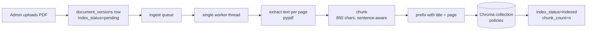

# Design — RAG Pipeline (Objective 2)

Companion to [design-auth.md](design-auth.md) and [design-policies.md](design-policies.md). Scope: objective 2 from [objectives.md](objectives.md), the retrieval-augmented generation pipeline that turns the policy repository built in objective 1 into something you can ask questions of.

**§1 to §8 cover the retrieval half** (plan tasks 2.1 to 2.5): extraction, chunking, embedding, the Chroma index and its lifecycle, and the internal `retrieve()` function, with index state surfaced in the admin UI. All of it runs locally and costs nothing.

**§9 covers the answering half** (tasks 2.6, 2.7, 2.9, 2.10), added 2026-08-08 when it was built. It replaces the contract this section originally sketched: the Anthropic tool-use loop became a single grounded call to a free OpenAI-compatible provider. The reasoning is kept in full because the change was forced by circumstances that may not recur, and a later reader deserves to know which parts were principle and which were constraint.

Still outstanding: the benchmark harness and tuning (2.11 to 2.13), which are blocked on the seed corpus rather than on any design question.

implementation-plan.md was renumbered on 2026-08-08 to match objectives.md, so the RAG pipeline is objective 2 in both documents and task IDs `2.x` belong to it.

## 1. The chunk size in implementation-plan.md is wrong, and silently so

implementation-plan.md §7 and task 2.3 originally specified **~800-token chunks**. That number does not survive contact with the embedding model the same plan chose. (The plan now carries the corrected value and a pointer back here; this section is the reasoning.)

`all-MiniLM-L6-v2` has a maximum input of **256 word pieces**. Chroma's default embedding function tokenizes with `max_length=256` and truncates past it. It does not warn, it does not error, it just returns a vector.

So an 800-token chunk behaves like this: the first ~256 tokens produce the embedding, the remaining ~550 tokens are invisible to retrieval, and the full text is still handed to the model as context if the chunk happens to be retrieved. A clause sitting in the back two-thirds of a chunk can never be matched by any query. On a benchmark this reads as unexplained recall misses on questions whose answer is in the document, which is the worst kind of bug to debug at the end of week 4 with an 80% target to hit.

**Decision: size chunks to the embedding window, not to the LLM context window.**

| Parameter | Value | Reasoning |
|---|---|---|
| Target chunk size | **850 characters** (~210 tokens) | Leaves headroom under 256 for the title prefix and for tokenizer variance. English prose runs about 4 characters per token |
| Hard cap | 1100 characters | A single sentence longer than the target still gets emitted rather than dropped, and still fits the window |
| Overlap | 130 characters (~15%) | Keeps a clause that straddles a boundary reachable from both sides |
| Boundary rule | Sentence-aware, never split mid-sentence unless a single sentence exceeds the hard cap | A half sentence embeds poorly and reads badly as a citation |
| Default `k` | **8** (plan said 6) | Smaller chunks carry less text each, so more of them are needed to cover the same answer. Cheap: 8 chunks of 850 characters is less context than 6 of 3200 |

Two consequences worth stating. The corpus produces roughly 3 to 4 times more chunks than the plan assumed, which is still nothing: 30 policies at ~20 pages lands near 1,500 chunks, about 2 MB of float32 vectors, exactly where implementation-plan.md §8.1 already put it. And chunk size stops being a free tuning knob for task 2.12: tuning it upward past ~1000 characters buys nothing because the extra text is not embedded. If the benchmark falls short, the levers are `k`, the title prefix, and the embedding model itself, in that order. Swapping to a hosted embedding model (Voyage, 32k input) is what unlocks larger chunks, and that is already the documented escape hatch in implementation-plan.md §10.

## 2. Pipeline



### 2.1 Extraction (plan task 2.2)

`pypdf` page by page. Each page's text is whitespace-normalized (collapse runs of spaces and newlines, strip hyphenation at line ends) and kept with its 1-based page number, because the page number is what makes a citation clickable later.

**Scanned PDFs fail loudly.** If extraction yields under 100 characters per page on average, the version is marked `index_status='failed'` with `index_error` explaining that the PDF has no extractable text layer and OCR is out of scope. implementation-plan.md §10 already scoped OCR out; this makes the failure visible in the admin UI instead of producing a document that is silently unsearchable.

**pdfplumber is not installed.** Plan task 2.2 lists it as a fallback for stubborn layouts. Deferring it: it is a heavy dependency to add on speculation, and the `failed` status plus `index_error` tells us whether any real policy in the corpus actually needs it. If one does, adding a fallback inside the extraction function is a contained change.

### 2.2 Chunking (plan task 2.3)

Per §1: split page text on sentence boundaries, accumulate sentences until adding the next would exceed 850 characters, emit, then start the next chunk 130 characters back. Chunks never span pages, so every chunk has exactly one page number to cite.

Each chunk's embedded text is prefixed `"{title}, page {n}: "`. This is the cheap precision win from implementation-plan.md §7: without it, a chunk of bare prose about "the penalty is 10% per day" carries no signal that it came from the Examination Policy, and a query naming the policy has nothing to match on.

### 2.3 Embedding and storage (plan task 2.1)

Chroma **embedded persistent client**, no separate process, data directory `backend/data/chroma`. One collection, `policies`.

**Cosine, set explicitly.** Chroma's default distance is L2. implementation-plan.md §7 specifies cosine, so the collection is created with `metadata={"hnsw:space": "cosine"}`. This is set once at creation and cannot be changed on an existing collection, so getting it wrong means rebuilding the index. Chroma returns distance; the pipeline converts with `similarity = 1 - distance`, clamped to [0, 1].

| Chroma field | Value |
|---|---|
| `id` | `doc{document_id}_v{version_id}_c{chunk_index}` (`version_id` is the `document_versions` row id, not the version number) |
| `document` | the prefixed chunk text |
| `metadata` | `{document_id, version_id, version_number, title, category, page, chunk_index}` |

**`OMP_NUM_THREADS=1`.** ONNX Runtime sizes its thread pool to the core count by default and will take every core it can during ingestion, starving the Flask threads it shares a process with (implementation-plan.md §8.4). Set in `run.py` before anything imports onnxruntime, and documented in `.env.example`.

**First run downloads the model.** Chroma's default embedding function pulls the ~80 MB ONNX model on first use and caches it under the user's home directory. Locally this is a one-time wait on the first upload after this change; the plan's Docker note (§8.4, bake it into the image) applies when deployment comes.

## 3. Index lifecycle

The rule that keeps this simple: **Chroma contains exactly the current version of every active document, and nothing else.** No stale versions, no archived documents. Retrieval therefore needs no filtering, because everything in the index is legitimately searchable. That is why archive deletes chunks rather than flagging them.

| Event | Index action |
|---|---|
| New document (v1) | Enqueue v1 |
| Replace version (v*n+1*) | Enqueue v*n+1*; on success, delete chunks `where version_id = <previous current version>` |
| Archive | Delete chunks `where document_id = <id>` immediately (synchronous, no queue: it is one delete call) |
| Restore | Enqueue the current version |
| Title or category edit | Enqueue the current version |
| Reindex action / CLI | Enqueue the current version, replacing whatever is there |

**Why a metadata edit triggers a full reindex.** The title is part of the embedded text (§2.2), so changing it invalidates every vector for that document, and a metadata-only update in Chroma would leave the old title baked into the embeddings. Category is metadata-only and could be patched in place, but branching on which field changed is more code than it saves: reindexing one document takes seconds, and metadata edits are rare and deliberate (an explicit Save in the admin table).

**Old versions stay on disk and stay in MySQL.** Only their vectors go. design-policies.md §1 keeps old PDFs for audit and that is unchanged; they are simply not searchable, which matches "the current policy is the answer" semantics.

**Deletion before indexing, or after?** After. The new version is embedded first, and the old version's chunks are deleted only once the new ones are stored. If ingestion crashes halfway, the document stays searchable at its previous version instead of falling out of the index entirely. A write that fails part-way through its batches also has its partial chunks removed, for the same reason: a truncated policy answering questions is worse than one that fell back a version.

**Archiving and indexing are serialized by a lock.** Extraction and embedding take seconds, and an archive landing inside that window would otherwise be undone by the write that follows it, leaving an archived policy searchable forever. The worker takes `store.index_lock`, re-reads the document's status and current version under it, and abandons the write if either changed; the archive path takes the same lock across its delete and commit. Archive requests block only while an ingest is actually running.

**The vector index lags metadata deletion.** Chroma removes a chunk's metadata synchronously but its nearest-neighbour index can keep returning that id for a while, with metadata of `None`. Metadata is therefore the authoritative record of index membership, and `retrieve()` drops any hit without it (§6). This is why archiving is safe despite the lag.

## 4. Schema changes

Three columns on `document_versions`. No new tables in this pass.

```sql
ALTER TABLE document_versions
  ADD COLUMN index_status ENUM('pending','indexing','indexed','failed')
      NOT NULL DEFAULT 'pending',
  ADD COLUMN chunk_count  INT NULL,
  ADD COLUMN index_error  VARCHAR(500) NULL,
  ADD KEY ix_document_versions_index_status (index_status);
```

The migration leaves existing rows at the `pending` default, so the startup recovery in §5 picks up the policies already uploaded and indexes them without a manual backfill step. That is plan task 2.4's backfill, done by the default value.

`index_error` is capped at 500 characters; a stack trace gets truncated to its message. The full traceback goes to the app log.

**`index_status` records the last indexing attempt for that version, not current membership of the index.** A superseded version keeps `indexed` and its old `chunk_count` after its vectors are deleted (§3). Nothing reads it that way: the admin table shows the *current* version's status, which is always accurate, and the index itself is authoritative about what is searchable. Worth knowing before reading `versions[]` in a document detail response and concluding two versions are both live.

**`query_logs` and `query_retrievals` are deliberately not created yet.** implementation-plan.md §6 defines them and §4.6 has `retrieve()` writing `query_retrievals` rows. Both belong to the agent pass: creating them now means two empty tables and a logging arm on `retrieve()` with nothing to attach to, and their shape is likelier to be right once the agent is real. `retrieve()` takes an optional `query_log_id` parameter from day one so adding the write is a few lines, not a signature change. The plan's §6 DDL is also still written in SQLite; it needs a MySQL rewrite when those tables land, the same way this section rewrote the `document_versions` columns.

## 5. Ingestion queue

A `queue.Queue` and **one** daemon consumer thread, started from the app factory. Uploads write the file and the `document_versions` row with `index_status='pending'`, enqueue the version id, and return `201` immediately. This is implementation-plan.md §8.3 and it is the main thing standing between a 30-PDF bulk upload and an unresponsive box.

Details that matter on this stack specifically:

- **The worker needs an app context.** It runs outside the request cycle, so it wraps its work in `app.app_context()` and uses `db.session` with an explicit `db.session.remove()` per item, so a long-lived thread does not hold a MySQL connection with a stale transaction open across jobs.
- **Do not start it twice.** Flask's debug reloader runs the app module in both the parent and the child process. The thread starts only when `WERKZEUG_RUN_MAIN` is set or the reloader is off, otherwise two workers race on the same Chroma directory, which corrupts rather than errors (§8.2 of the plan).
- **Recover orphans on startup.** Any row left at `indexing` from a killed process is flipped back to `pending` on boot, then every `pending` current version is enqueued. Without this, a restart mid-ingest strands documents that never become searchable and never report why.
- **Only current versions are indexed.** If a version is superseded while it sits in the queue, the worker skips it rather than indexing a version that is already historical.
- **Failures are terminal, not retried.** A PDF that fails extraction will fail again. It goes to `failed` with a message, and an admin can retry explicitly with the Reindex action once the cause is fixed.

## 6. Retrieval (plan task 2.5)

```python
retrieve(query: str, k: int = 8, query_log_id: int | None = None)
    -> [{chunk_id, document_id, version_id, version_number, title,
         category, page, text, similarity, rank}]
```

An in-process function, not a route (implementation-plan.md §4.6). It embeds the query, queries Chroma for top `k`, converts distance to similarity, and returns results ranked. The `query_log_id` parameter is accepted and currently unused; it becomes the `query_retrievals` write in the agent pass.

Callers: the answering path in §9 (via `POST /ask`), the `flask search` CLI in §8, and the benchmark harness once it exists. `document_id` scopes the search to a single policy, which is what the reader page's panel sends.

## 7. API changes

Additions to design-policies.md §4. Everything else is unchanged.

| Method + path | Role | Returns |
|---|---|---|
| `GET /api/v1/admin/documents/:id/index-status` | admin | `{version_id, version_number, index_status, chunk_count, index_error}` |
| `POST /api/v1/admin/documents/:id/reindex` | admin | `202 {version_id, index_status: "pending"}` |

`POST .../reindex` is an addition to implementation-plan.md §4.3, which only specified the read side. Without it a `failed` document is a dead end in the UI, and the only recovery is re-uploading the same PDF.

`index_status` and `chunk_count` are added to the version object in `GET /documents/:id`, and `index_status` (of the current version) to `DocumentSummary`. It appears in the student-facing list response too, which is harmless and avoids a separate admin list endpoint just for one field.

## 8. CLI

| Command | Purpose |
|---|---|
| `flask reindex [--document-id N]` | Re-enqueue one document, or every active document. The manual escape hatch behind plan task 2.4 |
| `flask search "<question>" [--k 8]` | Print top-k chunks with similarity, document, and page |

`flask search` is the verification tool for this pass. Retrieval quality is the whole foundation, and the benchmark harness that measures it properly (plan task 2.11) is two passes away, so being able to type a real question and read what comes back is what tells us whether chunking and the title prefix are doing their job before the agent is wired on top.

## 9. Answering (built 2026-08-08)

This section originally specified an `anthropic` SDK tool-use loop with one tool, `search_policies`, on `claude-opus-5`. That was replaced during implementation. Both the provider and the shape changed, and the reasons are worth keeping because they are the kind that get re-litigated later.

### 9.1 Why not Anthropic

The Anthropic organization had no API credits. That blocks the Messages API completely, including the free `count_tokens` endpoint, which returns a billing error rather than a result. Authentication was never the problem: OAuth via `ant auth login` worked and the credential resolved correctly through a bare `Anthropic()` client. Buying credits was out of scope, and no authentication method changes billing, so the provider had to change.

### 9.2 Why an OpenAI-compatible endpoint

The answering call now goes through the `openai` package to whatever `LLM_BASE_URL` points at. Groq, Gemini, Cerebras, OpenRouter, Ollama and Anthropic's own compatibility layer all speak this shape, so the provider is an `.env` edit rather than a code change. Given that the choice was forced once by circumstances outside the project, making it cheap to change again was worth the small indirection.

**Current provider: `openai/gpt-oss-120b` on Groq's free tier.** Selected over the alternatives on one criterion that outranked quota size: Groq's Services Agreement §4.2 bars training on inputs or outputs. The free tier with the larger allowance (Gemini) has terms permitting human review of API inputs, which is untenable for a pilot where real students ask questions like "can I appeal my exam result" under a consent notice. The policy PDFs are public; the questions are not.

Free-tier ceilings: 1,000 requests/day, 200K tokens/day, 8K tokens/minute. At roughly 2.7K tokens per question that is about 74 questions/day against a pilot projecting ~15.

### 9.3 Why a single call instead of an agent loop

The loop's purpose was query reformulation: let the model search again if the first retrieval was poor. Against that:

- `k` is fixed at 8 and the retrieved chunks total roughly 2K tokens, so everything the model could ask for is already in context. Lazy retrieval saves nothing.
- A loop costs 2 to 4 calls per question. Against 8K tokens/minute, that turns a 50-question benchmark run from about 17 minutes into an hour.
- Groq cannot combine tool calling with a strict JSON schema in one request, so the loop would need a second call purely to format its result.

Multi-hop retrieval remains the honest upgrade path if the benchmark shows questions failing for lack of it. It is not free to give up, just not worth its cost here.

### 9.4 Citations are parsed, not requested

The obvious schema is `{answered, answer_md, citations: [int]}`. It does not survive contact with the model: answering from extracts 1, 4, 5 and 8, it returned `citations: [1458]`, concatenating the digits. Constraining the array with a JSON-schema enum of the valid source numbers made it worse, because Groq validates the enum *after* generation and returns a 400 rather than decoding against it, converting a recoverable wrong value into a hard failure.

The inline `[n]` markers in the answer text, meanwhile, are consistently correct. So the schema asks only for `{answered, answer_md}` and the server extracts the markers with a regex. Fewer moving parts, and it depends on the output the model is demonstrably good at rather than the one it is not.

`citations[].n` keeps the number the reader sees in the text, so the numbers can be non-contiguous. A marker naming a source that was not retrieved is dropped with a warning rather than rendered as a chip pointing nowhere.

### 9.5 What carries over unchanged

- **Confidence:** mean similarity of the cited chunks. A query counts as answered only when the model set `answered: true`, at least one citation resolved, and confidence ≥ 0.35. The middle condition is the addition: a model answering with no citations has stopped being grounded whatever it claims.
- **`POST /api/v1/ask`** returns `AnswerResult` (plan §4.5), plus an optional `document_id` to scope retrieval to one policy, which is what the reader page's panel sends.
- **Logging:** `query_logs` and `query_retrievals` still arrive with objective 3, in MySQL (§4), with `session_id` from the first migration since it cannot be reconstructed afterwards. `log_id` is `null` in every response until then.
- **Streaming:** deferred rather than cancelled. Answers return in one to seven seconds, so request/response is adequate; revisit if the pilot shows users waiting.

## 10. Validation against constraints

- Chunks fit the embedding model's real input window, confirmed §1 and measured: two texts sharing a 360-word head embed to identical vectors, and truncation starts at ~254 tokens. ✅
- Chroma holds only current versions of active documents, so retrieval needs no status filter, confirmed §3. Held across an archive racing an in-flight ingest, and across a mid-write failure. ✅
- Ingestion is serialized behind one worker and survives restarts, confirmed §5. ✅
- Extraction failures are visible and recoverable rather than silent, confirmed §2.1, §7, §8. ✅
- Old PDFs and version history are untouched, so design-policies.md §1's audit trail holds, confirmed §3. ✅
- Retrieval costs nothing to run: local embeddings, local index, no network call. ✅
- Answering costs nothing per query, and the provider is swappable from `.env`, confirmed §9.2. ✅
- Student questions are not used for model training, confirmed §9.2 against the provider's agreement. ✅
- Answers are grounded: a response with no resolvable citation is reported unanswered regardless of what the model claims, confirmed §9.5. ✅
