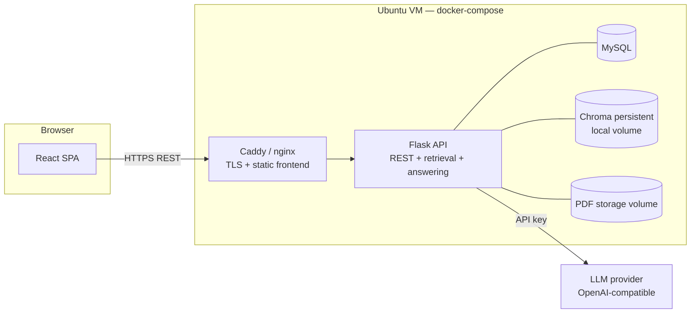
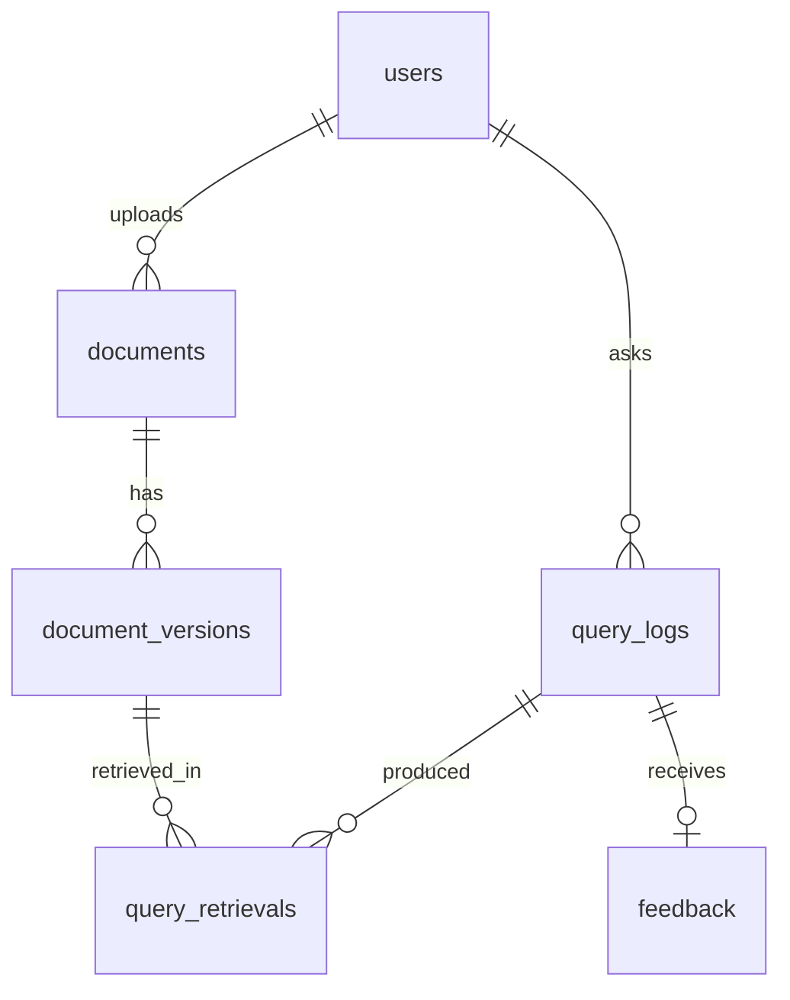

# Implementation Plan — University Policy RAG Platform

Companion to [objectives.md](objectives.md). Written 2026-08-05. Plans the full 9-week build, objective by objective, plus the API, WebSocket, database, and RAG designs.

Module-level designs live alongside this plan: [design-auth.md](design-auth.md), [design-policies.md](design-policies.md), [design-rag.md](design-rag.md).

Revised 2026-08-08: renumbered to match objectives.md, which merged the old objectives 1 and 2 on 2026-08-06 and added the analytics dashboard as objective 5. Task IDs were renumbered with their objectives, so task `2.4` now belongs to objective 2. Old objective 3 (RAG) is now objective 2, old 4 is now 3, and old 5 split into objective 4 (analysis and report) and objective 5 (dashboard). The same revision replaced the SQLite schema in §6 with MySQL, which §1 had already switched to on 2026-08-06, and corrected the chunk size in §7 (see [design-rag.md](design-rag.md) §1).

**Superseded 2026-08-08: Anthropic replaced by a free OpenAI-compatible provider, and the agent loop replaced by a single call.** The Anthropic organization had no API credits, which blocks the Messages API outright (even the free `count_tokens` endpoint returns a billing error), and buying credits was out of scope for the project. A survey of durable free tiers settled on Groq. That in turn forced a second decision: Groq cannot combine tool calling with a strict JSON schema in one request, and an agent loop costs 2 to 4 calls per question against an 8K-tokens-per-minute ceiling. Since `k` is fixed and the retrieved chunks already fit in context, the loop's only real benefit was query reformulation, so it was dropped in favour of a single grounded call. The retrieval half of the pipeline was unaffected: embeddings are local, and `retrieve()` never knew what consumed its output. Details in §7 and [design-rag.md](design-rag.md) §9.

## 1. Decisions and constraints

Recorded so later work doesn't re-litigate them:

| Decision | Choice |
|---|---|
| Backend | Flask (Python) REST API + Flask-SocketIO |
| Answering call | **Single grounded call** per question, in-process in Flask: retrieve top-k, render the chunks as numbered extracts, ask once for an answer with inline `[n]` citations. Superseded the planned `anthropic` SDK tool-use loop on 2026-08-08 (see below) |
| LLM provider | Any **OpenAI-compatible** endpoint, via the `openai` package. `LLM_BASE_URL`, `LLM_MODEL` and `LLM_API_KEY` are configuration, so changing provider is an `.env` edit. Groq, Gemini, Cerebras, OpenRouter, Ollama and Anthropic's compatibility layer all expose this shape |
| Answering model | `openai/gpt-oss-120b` on **Groq's free tier** (superseded `claude-opus-5` on 2026-08-08). No credit card, and Groq's Services Agreement §4.2 bars training on inputs or outputs, which matters because the student questions are the sensitive half of the data, not the policy PDFs. Free-tier ceilings: 1,000 requests/day, 200K tokens/day, 8K tokens/minute |
| Embeddings | Chroma built-in local model (all-MiniLM-L6-v2, free, offline). Upgrade path: Voyage AI or another hosted embedding API if benchmark precision falls short |
| Vector store | Chroma embedded persistent client (local volume, no separate server process). Swap to a Chroma server or hosted vector DB later without code changes if ever needed |
| Relational DB | MySQL via XAMPP (SQLAlchemy + PyMySQL). Superseded from SQLite on 2026-08-06 — see [design-auth.md](design-auth.md) §1 |
| Frontend | React (Vite) SPA |
| Realtime | Socket.IO between React and Flask. The RAG agent runs in-process, so there's no second internal bridge to build or operate |
| Concurrency model | **One** gunicorn worker, `gthread` worker class, ~8 threads. Forced independently by two constraints: Socket.IO needs a single worker unless you add a Redis message queue, and Chroma's persistent client is single-process. Explicitly **not** eventlet — the embedding model is CPU-bound native code that would stall every greenlet in the process (§8.2) |
| Auth | JWT (flask-jwt-extended); accounts for everyone — roles `student`, `admin`, `staff` (added 2026-08-06; staff's permission scope is not yet defined — currently behaves like `student` until a staff-specific module is designed) |
| Deployment | Single Ubuntu cloud VM, docker-compose, Caddy (or nginx) for TLS |
| Host sizing | 2 vCPU / 4 GB RAM + 2 GB swap. The peak load is PDF ingestion, not query serving (§8.1) |
| Dev machine | Windows 10 + Docker Desktop (WSL2) — same compose file runs locally and on the VM; repo lives inside the WSL2 filesystem (§8.6) |

## 2. System architecture



Flow of one question:

1. Student posts to `POST /api/v1/ask` (§4.5), optionally scoped to one policy with `document_id`.
2. Flask calls the retrieval function (§4.6), which embeds the question locally and searches Chroma for top-k chunks.
3. The chunks are rendered as numbered extracts and sent to the model in a **single** grounded call, constrained to a strict JSON schema of `{answered, answer_md}`.
4. Flask parses the inline `[n]` markers out of `answer_md` to build the citation list, computes confidence from the cited chunks' similarities, and returns `AnswerResult`.

From objective 3, step 1 also opens a `query_logs` row and step 4 finalizes it; that table does not exist yet. Streaming over Socket.IO (§5) is likewise deferred: with answers arriving in one to seven seconds, a plain request/response is adequate, and streaming is a UX improvement to make once the pilot shows it is needed.

Ingestion (upload → text extraction → chunking → embedding → Chroma) and answering both run inside Flask; ingestion writes, answering only reads. The two compete for the same CPU, which is why ingestion is serialized behind a single-worker queue (§8.3).

**Why single-shot rather than an agent loop.** The original design gave the model one tool, `search_policies`, and let it retrieve iteratively. Three things argued against it once the provider changed. `k` is fixed at 8 and the retrieved chunks total roughly 2K tokens, so everything the model could ask for is already in front of it and lazy retrieval saves nothing. A loop costs 2 to 4 calls per question, which against an 8K-tokens-per-minute free tier is the difference between a benchmark run of 17 minutes and one of an hour. And Groq cannot combine tool calling with a strict JSON schema in a single request, so keeping the loop would have meant a second call purely to format the result. The loop's genuine benefit, query reformulation for multi-hop questions, is recorded as the upgrade path in [design-rag.md](design-rag.md) §9 for when a paid model is in play.

## 3. Objective-by-objective plan

### Objective 1 — Centralized policy repository + administration module (Weeks 1–2)

**Goal:** platform hosts ≥30 policy PDFs, and an admin can add, replace (version), and archive them end to end.

Design: [design-auth.md](design-auth.md), [design-policies.md](design-policies.md).

Week 1 — repository:

| # | Task | Notes |
|---|---|---|
| 1.1 | Repo scaffolding | Monorepo: `backend/`, `frontend/`, `docker-compose.yml`, `.env.example` — the RAG agent lives inside `backend/` (e.g. `backend/app/agent.py`) |
| 1.2 | Flask app factory, SQLAlchemy models, Flask-Migrate | Tables from §6 (users, documents, document_versions now; the rest migrate in later) |
| 1.3 | Auth: register, login, JWT, role field | Seed one admin account via CLI command |
| 1.4 | PDF upload + storage | Multipart upload, validate `application/pdf`, 25 MB cap, store under `data/pdfs/{document_id}/v{n}.pdf`, sha256 hash |
| 1.5 | Document list/detail/file endpoints | §4.2 |
| 1.6 | React shell | Vite + router; pages: Login/Register, Policy Library (search/filter by category), PDF viewer (iframe or react-pdf) |
| 1.7 | Seed corpus | Bulk-upload script; load ≥30 real policy PDFs |

Week 2 — administration module:

| # | Task | Notes |
|---|---|---|
| 1.8 | Role-gated admin API | `role_required("admin")` decorator; 403 for students |
| 1.9 | Add policy | Same upload path as 1.4 exposed in admin UI with metadata form |
| 1.10 | Replace version | New `document_versions` row, `version_number` +1, document points at new current version; old file retained for audit |
| 1.11 | Archive / restore | `status` flip; archived policies hidden from student library and (from Week 3) removed from the Chroma index |
| 1.12 | Admin UI | Documents table with actions: upload, replace, archive, view versions |
| 1.13 | Audit trail | `uploaded_by` on every version; simple activity list on the admin dashboard |

**Done when:** an authenticated user can browse and open all 30+ policies in the browser, and an admin performs add → replace → archive on a test policy entirely through the UI.

### Objective 2 — RAG pipeline (Weeks 3–4)

**Goal:** natural-language Q&A with citations; ≥80% top-k retrieval precision on a 50-question benchmark.

Design: [design-rag.md](design-rag.md).

Week 3 — ingestion + retrieval:

| # | Task | Notes |
|---|---|---|
| 2.1 | Chroma client wiring | Embedded persistent client (no separate container); collection `policies`, cosine space set at creation; data dir on the app-data volume |
| 2.2 | Text extraction | `pypdf` per page, store page boundaries; scanned PDFs (no text layer) fail loudly as `index_status='failed'`. `pdfplumber` stays an unadded fallback until a real policy needs it (design-rag.md §2.1) |
| 2.3 | Chunking | ~850-character chunks (~210 tokens), 130-character overlap, never split mid-sentence; each chunk prefixed with title and page; metadata: `document_id`, `version_id`, `title`, `category`, `page`, `chunk_index` |
| 2.4 | Index on upload + backfill command | Version replace = index new, then delete old version's chunks; archive = delete chunks. `index_status` tracked per version; ingestion serialized behind one worker thread (§8.3) |
| 2.5 | Internal retrieval function | `retrieve()` (§4.6): embed query, top-k (default 8) with similarities |

Week 4 — answering + UI:

| # | Task | Notes | Status |
|---|---|---|---|
| 2.6 | LLM client | `openai` package against an OpenAI-compatible endpoint; `LLM_BASE_URL` / `LLM_MODEL` / `LLM_API_KEY` in env. Provider is config, not code | done |
| 2.7 | Grounded prompt + strict schema | Prompt: answer only from the numbered extracts, cite every claim inline as [n], set `answered:false` when the extracts don't cover it or the question isn't about policy. Response constrained to `{answered, answer_md}` | done |
| 2.8 | Socket.IO streaming | Events in §5.2. **Deferred**: answers return in 1 to 7 seconds, so request/response is adequate. Revisit if the pilot shows users waiting | deferred |
| 2.9 | Answer UI | `AiQueryPanel` on the library and reader pages: answer with citation markers rendered as chips, numbered sources list linking to each policy, confidence badge, explicit not-covered state | done |
| 2.10 | `POST /api/v1/ask` | Optional `document_id` scopes the search to one policy, which is what the reader page's panel sends. Also the benchmark harness's entry point | done |
| 2.11 | Benchmark harness | `eval/benchmark.py`: 50 questions + expected source document(s); computes recall@k plus answer-citation accuracy. **The retrieval metric needs no model calls**, so it runs at zero cost | todo |
| 2.12 | Tuning loop | If <80%: raise k, strengthen the chunk title prefix; last resort switch embedding model, which is also what unlocks larger chunks (design-rag.md §1) | todo |
| 2.13 | Model comparison | Re-run 2.11's answer-quality metrics across free models (`gpt-oss-120b`, `llama-3.3-70b-versatile`) and, if credits ever exist, a paid model. Replaces the planned Anthropic effort sweep, which no longer applies | todo |

**Done when:** benchmark reports ≥80% recall@k and cited answers work in the UI. The UI half is done; the benchmark needs the seed corpus first.

### Objective 3 — Pilot deployment + query logging (Weeks 5–6)

**Goal:** ≥20 real users for two weeks; every query logged; ≥200 logged queries.

| # | Task | Notes |
|---|---|---|
| 3.1 | Complete QueryLog wiring | Every path (WS + `/ask`) writes text, timestamp, retrievals, confidence, status incl. `unanswered`, latency, token usage |
| 3.2 | Provision VM | Ubuntu 22.04+, Docker, compose; DNS + TLS via Caddy |
| 3.3 | Production compose | Restart policies, resource limits, volumes for MySQL/Chroma/PDFs; env-file secrets; API key never in the image |
| 3.4 | Safeguards | Per-user rate limit (e.g. 10 questions/hour), request size limits. The spend alert this originally called for is moot on a free tier; what replaces it is watching the provider's daily token budget, since exhausting it takes the pilot down for the rest of the day |
| 3.5 | Backups | Nightly cron: `mysqldump` + Chroma volume + PDFs → tarball, keep 14 days |
| 3.6 | Onboarding | Recruit ≥20 users, one-page guide, consent note that queries are logged for research |
| 3.7 | Pilot operations | Monitor logs/disk/spend; hotfix channel; weekly checkpoint on query volume vs. 200 target |

**Done when:** two-week window closes with ≥200 logged queries from ≥20 distinct users.

### Objective 4 — Analysis & evaluation report (Weeks 7–9)

**Goal:** evaluation report with accuracy metrics and policy-ambiguity charts for leadership.

| # | Task | Notes |
|---|---|---|
| 4.1 | CSV export | Query logs + retrievals for offline analysis |
| 4.2 | Re-run benchmark on pilot data | Retrieval accuracy on real queries (manual relevance labels on a sample) vs. the synthetic 50 |
| 4.3 | Ambiguity analysis | Cluster unanswered/low-confidence queries (embedding clustering over query texts); map clusters to policies or gaps. Run offline as a script, not in a request — it re-embeds every query and would peg the VM (§8.1) |
| 4.4 | Evaluation report | Method, metrics, charts, findings, recommendations to leadership; final write-up for the project document |

**Done when:** report delivered; the objective 5 dashboard demonstrates the same numbers live.

### Objective 5 — Admin analytics dashboard (Week 6, concurrent with objective 3)

**Goal:** the data objective 3 logs, visible live to admins. Read-only reporting on existing data, no new logging.

| # | Task | Notes |
|---|---|---|
| 5.1 | Analytics API (§4.4) | Summary stats, top queries, unanswered, low-confidence, per-document demand |
| 5.2 | Admin analytics dashboard | Charts: query volume over time, answered vs unanswered, confidence distribution, most-queried policies, most-ambiguous policies (retrieved-often-but-cited-rarely, plus reformulation chains via `session_id` — see §4.4) |

**Done when:** the dashboard renders query volume over time, answered-vs-unanswered rate, most-queried and most-ambiguous policies, live from `query_logs`.

Listed last to match objectives.md, but it is built in Week 6 alongside objective 3, not after objective 4. It reads only data objective 3 already collects, so it adds no data-collection requirement and does not extend the timeline.

## 4. REST API specification

Base path `/api/v1`. JSON everywhere except file upload (multipart) and file download. Auth: `Authorization: Bearer <JWT>`. Errors share one shape:

```json
{ "error": { "code": "not_found", "message": "Document 42 does not exist" } }
```

Codes: `validation_error` (400), `unauthorized` (401), `forbidden` (403), `not_found` (404), `conflict` (409), `rate_limited` (429), `server_error` (500).

### 4.1 Auth

| Method + path | Body | Returns |
|---|---|---|
| `POST /auth/register` | `{name, email, password}` | `201 {user, access_token}` |
| `POST /auth/login` | `{email, password}` | `{user, access_token}` |
| `GET /auth/me` | — | `{user}` |

`user` object: `{id, name, email, role, created_at}`.

### 4.2 Documents (any authenticated user)

| Method + path | Params | Returns |
|---|---|---|
| `GET /documents` | `?q=&category=&status=active&page=&per_page=` | `{items: [DocumentSummary], total, page, per_page}` |
| `GET /documents/:id` | — | `Document` (includes `versions[]`) |
| `GET /documents/:id/file` | `?version=` (default current) | PDF bytes, `Content-Disposition: inline` |
| `GET /documents/categories` | — | `{categories: [string]}` |

```json
// DocumentSummary
{ "id": 1, "title": "Examination Policy", "category": "Academic",
  "status": "active", "current_version": 2, "updated_at": "2026-08-01T09:00:00Z" }

// Document adds:
{ "versions": [ { "id": 7, "version_number": 2, "page_count": 14,
    "uploaded_at": "...", "uploaded_by": "Jane Admin",
    "index_status": "indexed", "chunk_count": 45 } ] }
```

### 4.3 Admin — repository maintenance (role: admin)

| Method + path | Body | Returns |
|---|---|---|
| `POST /admin/documents` | multipart: `file`, `title`, `category`, `effective_date?` | `201 Document` (ingestion queued) |
| `POST /admin/documents/:id/versions` | multipart: `file`, `effective_date?` | `201 Document` (new current version, reindex queued) |
| `PATCH /admin/documents/:id` | `{title?, category?, status?}` (`status: "archived"` = archive, `"active"` = restore) | `Document` |
| `GET /admin/documents/:id/index-status` | — | `{version_id, index_status, chunk_count, error?}` |

### 4.4 Admin — logs & analytics (role: admin)

| Method + path | Params | Returns |
|---|---|---|
| `GET /admin/query-logs` | `?from=&to=&status=&user_id=&page=&format=csv` | paginated `QueryLog[]` or CSV |
| `GET /admin/analytics/summary` | `?from=&to=` | `{total_queries, distinct_users, answered, unanswered, error, avg_confidence, avg_response_ms, queries_per_day: [{date, count}]}` |
| `GET /admin/analytics/top-queries` | `?limit=20` | `[{query_cluster_label, count, avg_confidence, example_queries[]}]` |
| `GET /admin/analytics/documents` | — | `[{document_id, title, times_retrieved, times_cited, avg_similarity}]` |
| `GET /admin/analytics/ambiguous` | `?limit=20` | `[{document_id, title, times_retrieved, times_cited, cite_rate, mean_similarity, unanswered_queries, sample_queries[]}]` |

**Why ambiguity is measured on retrievals, not on confidence.** Confidence is the mean similarity of the chunks the agent actually *cited* (§5.3), so an `unanswered` query cites nothing and has NULL confidence — the very queries that signal an ambiguous or missing policy would be invisible in a confidence-based per-document metric. `query_retrievals` rows exist regardless, including for unanswered queries, so ambiguity is computed from the gap between them: a policy that gets **retrieved often but cited rarely**, with low mean similarity, is one the retriever keeps surfacing and the model keeps finding unhelpful. That's the signal objectives 4 and 5 want, and it's available from data the pipeline already writes.

### 4.5 Queries (student-facing)

| Method + path | Body | Returns |
|---|---|---|
| `POST /ask` | `{question, document_id?}` | `AnswerResult`. `document_id` scopes retrieval to one policy; omit it to search the whole corpus. **Built** |
| `GET /queries/mine` | `?page=` | user's past `{question, answer, confidence, created_at, citations}`. Needs `query_logs` (objective 3) |
| `POST /queries/:log_id/feedback` | `{rating: "up"\|"down", comment?}` | `204`. Needs `query_logs` (objective 3) |

Error codes specific to `/ask`: `rate_limited` (429) when the provider's per-minute ceiling is hit, which on a free tier is an expected condition rather than a fault, and `upstream_error` (502) when the provider call fails outright.

```json
// AnswerResult
{
  "log_id": 314,
  "question": "How many CATs contribute to my final grade?",
  "answered": true,
  "answer_md": "Continuous assessment contributes 30% ... [1] ... [2]",
  "citations": [
    { "n": 1, "document_id": 4, "title": "Examination Policy",
      "version_id": 9, "page": 3, "chunk_id": "doc4_v9_c12", "similarity": 0.83 }
  ],
  "confidence": 0.79,
  "response_ms": 6120,
  "model": "openai/gpt-oss-120b"
}
```

`answer_md` is markdown with inline `[n]` markers, and `citations[].n` carries the same number the reader sees in the text. The numbers are the ranks of the retrieved extracts, so they can be non-contiguous (an answer citing extracts 1, 4 and 5 produces three citations numbered 1, 4 and 5). That is deliberate: markers and chips line up without rewriting the model's text. `log_id` is `null` until `query_logs` exists in objective 3.

**Citations are parsed from the answer text, not requested as a field.** Asked for a `citations: [int]` array alongside the answer, the model concatenated the digits of the extracts it used, returning `[1458]` for extracts 1, 4, 5 and 8. Constraining the array with a JSON-schema enum did not fix it: Groq validates the enum after generation and returns a 400 rather than decoding against it, which turned a wrong value into a hard failure. The inline `[n]` markers, meanwhile, are consistently correct, so the response schema asks only for `{answered, answer_md}` and the server extracts the markers. Fewer moving parts, and it relies on the output the model is demonstrably good at.

### 4.6 Internal retrieval (in-process function, not a route)

`retrieve(query: str, k: int = 8, query_log_id: int | None = None, document_id: int | None = None) -> [{chunk_id, document_id, version_id, version_number, title, category, page, text, similarity, rank}]` — embeds the query, searches Chroma, and (from objective 3) inserts `query_retrievals` rows. Called by `POST /ask` and by the benchmark harness (2.11); no network hop or shared secret needed since it never leaves the process. `document_id` scopes the search to a single policy. Only `status=active` documents' current versions are in the index at all, so no status filter is applied (design-rag.md §3).

## 5. WebSocket specification

> **Deferred as of 2026-08-08, not cancelled.** Answers currently return in one to seven seconds from a single call, so `POST /ask` (§4.5) is adequate and Socket.IO is not wired up. The spec below stands as written for when streaming is worth adding: the trigger would be the pilot showing users waiting, or a switch to a slower or larger model. Two parts of it are already obsolete, since there is no longer an agent loop to stream from: the `sources` event fires once rather than cumulatively, and §5.3's agent-lifecycle mapping collapses to a single model call.

### 5.1 Transport

Socket.IO (works through proxies, auto-reconnect, fallback polling). Namespace `/qa`. Client authenticates at connect: `io("/qa", { auth: { token: JWT } })`; invalid token → `connect_error`.

### 5.2 Client ↔ Flask events

Client → server:

| Event | Payload | Notes |
|---|---|---|
| `ask` | `{question: string, client_ref: string}` | `client_ref` is a client-generated id so the UI can match the ack |
| `cancel` | `{query_id}` | best-effort abort |

Server → client (all carry `query_id`):

| Event | Payload | When |
|---|---|---|
| `query_accepted` | `{query_id, client_ref}` | immediately; UI swaps client_ref → query_id |
| `status` | `{query_id, stage: "queued"\|"retrieving"\|"generating"}` | stage transitions; drives the typing indicator |
| `sources` | `{query_id, sources: [{chunk_id, document_id, title, page, similarity}]}` | once, after retrieval (the loop that made this cumulative is gone) |
| `token` | `{query_id, text}` | streamed answer fragments; append in order |
| `answer` | `AnswerResult` (§4.5) | final; replaces streamed text with the canonical answer + citations |
| `error` | `{query_id, code: "agent_timeout"\|"agent_error"\|"rate_limited"\|"cancelled", message}` | terminal failure; UI offers retry |

Contract: a query terminates with exactly one `answer` **or** one `error`. `token` events may be dropped by the client with no loss — `answer.answer_md` is always the complete text (that's why the frontend can rely on it after a reconnect).

### 5.3 Agent loop → client events (internal)

Superseded along with the loop, and kept only as a sketch of what to emit if streaming is picked up later. Answering runs in the same Flask process as the Socket.IO server would, so there is no wire protocol here, just a mapping from the call's lifecycle to the client events in §5.2. With a single call the middle rows collapse: one retrieval, one `sources` emission, one generation.

| Agent lifecycle | Maps to client event |
|---|---|
| loop starts | `status: generating` |
| retrieval starts | `status: retrieving`, then `sources` once §4.6 returns |
| token from the model | `token` |
| final structured turn: `answered: bool, answer_md, citations: [{n, chunk_id}]` | Flask joins citations against the retrieval rows to build full citation objects, computes confidence, writes the log, emits `answer` |
| unhandled exception / API error | `error` |

Timeout: 120s per query; on expiry Flask cancels the loop, emits `error {code:"agent_timeout"}`, and marks the log row `error`.

**Confidence score** (computed by Flask, stored on the log): mean similarity of the chunks actually cited in the final answer's citations (0–1). `answered:false` from the agent, or confidence < 0.35, marks the query `unanswered` — the dataset objective 4 mines for policy gaps.

## 6. Database design

MySQL (XAMPP locally), InnoDB, `utf8mb4`, via SQLAlchemy + PyMySQL with Flask-Migrate migrations. Chroma holds vectors only; MySQL is the source of truth.

Tables marked **built** exist today; the rest arrive with the objective that needs them.



```sql
-- built (objective 1)
users (
  id                INT AUTO_INCREMENT PK,
  name              VARCHAR(120)  NOT NULL,
  email             VARCHAR(190)  NOT NULL UNIQUE,   -- 190, not 255: utf8mb4 index limit
  password_hash     VARCHAR(255)  NOT NULL,
  role              ENUM('student','admin','staff') NOT NULL DEFAULT 'student',
  created_at        DATETIME      NOT NULL,
  last_login_at     DATETIME      NULL
)

-- built (objective 1)
documents (
  id                 INT AUTO_INCREMENT PK,
  title              VARCHAR(200) NOT NULL,
  category           VARCHAR(100) NOT NULL,
  status             ENUM('active','archived') NOT NULL DEFAULT 'active',
  current_version_id INT NULL FK -> document_versions.id,
  created_by         INT NOT NULL FK -> users.id,
  created_at         DATETIME NOT NULL,
  updated_at         DATETIME NOT NULL
)

-- built (objective 1); index_* columns added by objective 2
document_versions (
  id             INT AUTO_INCREMENT PK,
  document_id    INT NOT NULL FK -> documents.id,
  version_number INT NOT NULL,                    -- UNIQUE (document_id, version_number)
  file_path      VARCHAR(500) NOT NULL,
  file_sha256    CHAR(64)     NOT NULL,
  page_count     INT NULL,
  uploaded_by    INT NOT NULL FK -> users.id,
  uploaded_at    DATETIME NOT NULL,
  index_status   ENUM('pending','indexing','indexed','failed')
                   NOT NULL DEFAULT 'pending',     -- objective 2
  chunk_count    INT NULL,                         -- objective 2
  index_error    VARCHAR(500) NULL                 -- objective 2
)

-- objective 3: the QueryLog table from objectives.md
query_logs (
  id            INT AUTO_INCREMENT PK,
  user_id       INT NOT NULL FK -> users.id,
  session_id    CHAR(36) NOT NULL,        -- client-generated per chat session; lets
                                          -- objectives 4 and 5 detect reformulation
                                          -- chains (same user rephrasing the same
                                          -- question). Cannot be reconstructed after
                                          -- the fact, so it ships with the table.
  query_text    TEXT NOT NULL,
  created_at    DATETIME NOT NULL,        -- timestamp
  status        ENUM('pending','answered','unanswered','error','cancelled') NOT NULL,
  answer_text   MEDIUMTEXT NULL,
  confidence    FLOAT NULL,               -- 0-1, NULL until final
  response_ms   INT NULL,
  model         VARCHAR(60) NULL,
  input_tokens  INT NULL,
  output_tokens INT NULL,
  error_code    VARCHAR(40) NULL
)

-- objective 3: "retrieved documents" per query
query_retrievals (
  id                  INT AUTO_INCREMENT PK,
  query_log_id        INT NOT NULL FK -> query_logs.id,
  document_id         INT NOT NULL FK -> documents.id,
  document_version_id INT NOT NULL FK -> document_versions.id,
  chunk_id            VARCHAR(80) NOT NULL,   -- Chroma id: doc{d}_v{v}_c{i}
  page                INT NULL,
  rank                INT NOT NULL,           -- position in that retrieval call
  similarity          FLOAT NOT NULL,
  cited               BOOLEAN NOT NULL DEFAULT 0  -- set when it lands in the citations
)

-- objective 3
feedback (
  id           INT AUTO_INCREMENT PK,
  query_log_id INT NOT NULL UNIQUE FK -> query_logs.id,
  user_id      INT NOT NULL FK -> users.id,
  rating       ENUM('up','down') NOT NULL,
  comment      TEXT NULL,
  created_at   DATETIME NOT NULL
)
```

Indexes: `query_logs(created_at)`, `query_logs(user_id)`, `query_logs(status)`, `query_logs(session_id)`, `query_retrievals(query_log_id)`, `query_retrievals(document_id)`, `document_versions(document_id)`, `document_versions(index_status)`.

Two MySQL-specific notes. `email` is `VARCHAR(190)` rather than 255 because a `utf8mb4` column indexes at 4 bytes per character and the InnoDB index prefix limit is 767 bytes on older row formats. And `rank` is a reserved word in MySQL 8, so it needs backticks in raw SQL; SQLAlchemy quotes it automatically.

**Circular foreign key.** `documents.current_version_id` points at `document_versions.id`, and `document_versions.document_id` points back at `documents.id`. SQLAlchemy cannot order the `CREATE TABLE` statements for a cycle, so one side needs `use_alter=True` on its `ForeignKey`, and creating a document is a three-step write: insert the document with `current_version_id` NULL, insert the version, then update the document to point at it. This landed as predicted in objective 1.

**Chroma collection `policies`** — one entry per chunk:
`id = "doc{document_id}_v{version_id}_c{chunk_index}"`, `document = chunk text prefixed with title and page`, `metadata = {document_id, version_id, version_number, title, category, page, chunk_index}`. The collection holds exactly the current version of every active document: replacing a version adds the new chunks then deletes `where {version_id: old}`, archiving deletes `where {document_id}`. Retrieval therefore needs no filter (design-rag.md §3).

## 7. RAG pipeline details

- **Extraction:** `pypdf` per page → normalize whitespace → keep page numbers for citation mapping.
- **Chunking:** ~850 characters (~210 tokens), 130-character overlap, sentence-boundary aware, never spanning a page; each chunk prefixed with `"{title}, page {n}: "` so the embedding carries document identity (cheap precision win). **Corrected 2026-08-08 from the original ~800 tokens**, which exceeded the embedding model's real input window and would have made two-thirds of every chunk unretrievable, silently. Full reasoning in [design-rag.md](design-rag.md) §1.
- **Retrieval:** cosine similarity, top-k = 8 default (benchmark tunes k). Cosine is set on the Chroma collection at creation, since the default is L2 and it cannot be changed afterwards.
- **Answering contract:** one call per question. The system prompt pins behavior — answer only from the numbered extracts, never from general knowledge about universities; cite every factual claim inline as `[n]`; if the extracts don't answer the question, say plainly what is missing and set `answered:false` with no citations; refuse non-policy questions the same way. The response is constrained to a strict JSON schema of `{answered, answer_md}`; citations are parsed from the markers (§4.5).
- **Confidence and the `answered` flag:** confidence is the mean similarity of the cited chunks. A query is reported as answered only if the model set `answered:true` **and** at least one citation resolved **and** confidence ≥ 0.35. The middle condition matters: a model that answers without citing anything has stopped being grounded, whatever it claims.
- **Cost:** **zero per query.** Embeddings run locally and the answering model is on Groq's free tier. What replaces a spend budget is a rate budget: 200K tokens/day at roughly 2.7K tokens per question is about 74 questions/day, against a pilot projecting ~15/day. Per-model buckets are independent, so `llama-3.3-70b-versatile` is a fallback with its own allowance. The billing alert in task 3.4 is moot while this holds; reinstate it if a paid model is ever substituted.
- **Prompt caching:** not applicable on the current provider and not needed. The prefix is a ~400-token system prompt, and each question's extracts differ, so there is little stable prefix to cache. This becomes relevant again only if the platform moves to a provider that bills per token.
- **Benchmark metric (objective 2):** for each of 50 questions with labeled source documents, retrieval is a hit if a labeled document appears in top-k. The score is hits/50 ≥ 0.80. Note for the write-up: this is **recall@k** (equivalently hit-rate@k), not precision — precision@k would divide relevant results by k. Objective 2 calls it "top-k retrieval precision"; report the number under both names once so a reader checking the arithmetic isn't misled. Secondary metrics: citation accuracy (cited doc is a labeled doc), unanswered false-positive rate, and mean reciprocal rank.

## 8. Performance and resource budget

Everything runs in one Python process on a small VM, so the design has to be explicit about where the CPU and memory actually go. The short version: **the embedding model is the only heavy thing on this box, and PDF ingestion is the only time it works hard.** Query serving is almost entirely network wait.

### 8.1 Where the load actually is

| Work | Cost | When |
|---|---|---|
| Embedding a query | ~10–40 ms CPU | Every question |
| Chroma vector search | under a millisecond | Every question |
| LLM API round trip | 1–7 s measured, ~zero local CPU | Every question (exactly once) |
| PDF text extraction + chunking | 1–10 s CPU per document | Upload / re-index only |
| Embedding a document | ~5–15 chunks/sec on one core | Upload / re-index only |

Two things follow. First, **retrieval is not worth optimizing** — over 95% of a query's wall-clock is the model call, so latency work belongs in the effort setting (§8.5) and in streaming tokens so the answer *starts* fast. Second, the vector store is not a resource concern at this scale: 30 policies produce roughly 1,000–2,000 chunks, and 1,500 × 384-dimension float32 vectors is about 2 MB. The index fits in RAM many times over. What costs memory is the embedding *model*, not the embeddings.

### 8.2 Concurrency model — threads, not greenlets

Run gunicorn as `--workers 1 --worker-class gthread --threads 8`, with Flask-SocketIO in `threading` mode.

One worker is not a tuning choice, it's forced twice over: Flask-SocketIO needs a single worker to broadcast correctly unless you add Redis as a message queue, and Chroma's persistent client expects a single process against its data directory. Running two workers breaks both at once, and the Chroma failure mode is index corruption rather than a clean error. Pin it to 1 and leave a comment saying why.

The worker *class* matters just as much. Under eventlet, everything runs as cooperative greenlets on one OS thread, and a greenlet only yields on patched I/O. The embedding model is native ONNX code that yields nothing — so embedding a document freezes every other greenlet in the process: no Socket.IO heartbeats, no HTTP responses, clients time out and disconnect mid-answer. With OS threads, ONNX releases the GIL during inference, so the web server keeps serving while a document is being embedded. eventlet is also in low-maintenance mode and awkward on recent Python versions, which is a second reason not to build a 9-week project on it.

Consequences to build in from day one: SQLAlchemy sessions must be per-thread (`scoped_session`), and any thread outside the request cycle (the ingestion worker, the agent) has to push an app context and call `db.session.remove()` when it finishes an item, so it doesn't hold a MySQL connection with a stale transaction open between jobs. MySQL also drops idle connections after `wait_timeout`, so set `pool_pre_ping` on the engine or a long-idle worker wakes up to a dead socket.

### 8.3 Serialize ingestion behind a one-worker queue

This is the single most important safeguard against overloading the box, and it's cheap: a `queue.Queue` plus **one** consumer thread. Uploads write the file and the `document_versions` row with `index_status='pending'`, enqueue the version id, and return `201` immediately; the consumer embeds one document at a time.

Without it, task 1.7's bulk-upload script fires 30 PDFs at once and starts 30 concurrent embedding jobs on 2 vCPUs — the box thrashes, the web server goes unresponsive, and the uploads themselves time out. With it, the same 30 documents take a couple of minutes in the background while the site stays usable.

Two details that turn this from "works on my machine" into "works in week 5":

- **Recover orphans on startup.** If the container restarts mid-ingest, rows are stranded at `index_status='indexing'` forever. On app start, flip any `indexing` row back to `pending` and re-enqueue it. One query, and it's the difference between a self-healing system and mystery documents that never become searchable.
- **Cap upload size before parsing, not after.** The 25 MB limit from task 1.4 must be enforced on the stream, so a malformed or oversized upload can't balloon memory inside `pypdf`.

### 8.4 Stop the embedding model from eating both cores

By default ONNX Runtime and OpenMP size their thread pools to the core count, so on a 2-vCPU VM the embedding job grabs both cores and starves the web server it shares a process with. Set `OMP_NUM_THREADS=1` and the ONNX intra-op thread count to 1 in the Flask container. Ingestion gets slightly slower; the site stays responsive throughout, which is the trade you want.

Also **bake the embedding model into the Docker image at build time.** Chroma's default embedding function downloads the ~80 MB ONNX model on first use; if that lands in an ephemeral container filesystem, every restart re-downloads it and the first query after a deploy stalls. Download it in the Dockerfile, or persist the cache directory on the app-data volume.

### 8.5 Model-side levers

Rewritten 2026-08-08: the original advice here was about Anthropic's `effort` and thinking parameters, which no longer apply.

- **The budget to manage is rate, not spend.** With a free tier, the constraint is 200K tokens/day and 8K tokens/minute, not dollars. The lever with the most effect on both is `k`: each retrieved chunk is roughly 210 tokens, so dropping `k` from 8 to 6 cuts about 15% of the input on every question. Tune it against the benchmark rather than by feel, since it trades directly against recall.
- **`temperature=0`.** Grounded extraction is not a task that benefits from sampling variety, and determinism makes the benchmark reproducible.
- **`max_tokens` sized for the answer alone.** Without a thinking budget folded in, the ~1200 default is generous for a few paragraphs with citations. Raise it only if answers truncate.
- **Latency is the API round trip**, measured at 1 to 7 seconds. Retrieval is under 50 ms, so optimising it would be pointless. If perceived speed becomes a complaint, the fix is streaming (§5), not a faster retriever.
- **Model choice is now a quality lever rather than a cost one**, since the alternatives are also free. Task 2.13 compares them on the benchmark.

### 8.6 Dev machine (Windows 10 + WSL2)

- **Keep the repo inside the WSL2 filesystem** (`~/university-policy` in the Linux distro), not under `C:\Users\...`. Bind-mounting a Windows path into a container crosses the 9p filesystem bridge and makes file I/O roughly an order of magnitude slower — Vite hot reload becomes seconds, and `pip install` crawls. This one setting is the difference between comfortable and miserable local development.
- **Give WSL2 a memory ceiling** in `%UserProfile%\.wslconfig` (4–6 GB). Left unset it will claim up to half of host RAM and Windows starts swapping.
- **Build the frontend in the image, not on the VM.** A Vite production build is memory-hungry; on a 2 GB VM it can OOM. Use a multi-stage Dockerfile (`node` build stage → copy `dist/` into the Caddy stage) so the heavy step happens wherever you build, not in production.

### 8.7 Memory budget

| Component | Steady | Peak |
|---|---|---|
| Flask + SQLAlchemy + deps | ~200 MB | ~250 MB |
| ONNX Runtime + MiniLM weights | ~350 MB | ~400 MB |
| Chroma index (1–2k chunks) | ~30 MB | ~60 MB |
| PDF parsing (`pypdf`) | 0 | 100–400 MB per document |
| Caddy | ~30 MB | ~50 MB |
| **Total** | **~600 MB** | **~1.2 GB** |

**2 vCPU / 4 GB with 2 GB swap** is the recommendation. 2 GB of RAM technically fits the steady state but leaves nothing for an ingestion spike, and the pilot is not the time to discover the OOM killer. Set `mem_limit` on the Flask service in compose so a runaway ingest gets killed and restarted rather than taking the whole VM down with it.

One serving note: return PDFs with `send_file(..., conditional=True)` so range requests work. `pdf.js` (behind react-pdf) then fetches only the byte ranges it needs to render the cited page, instead of pulling a whole 25 MB file to show page 3 — less memory in the Flask process and much faster citation chips.

## 9. Deployment layout

```yaml
# docker-compose.yml (shape, not final)
services:
  caddy:      # TLS, serves frontend build, proxies /api and /socket.io to flask
  flask:      # gunicorn --workers 1 --worker-class gthread --threads 8
              # + retrieval/answering + ingestion worker thread
              # env: LLM_API_KEY, LLM_BASE_URL, LLM_MODEL, OMP_NUM_THREADS=1, DB_HOST=mysql
              # mem_limit: 2g;  mounts app-data volume (PDFs, Chroma index)
  mysql:      # mysql:8, utf8mb4; mounts mysql-data volume
              # not exposed to the host: only flask talks to it
volumes: [app-data, mysql-data, caddy-data]
```

XAMPP is the local development database only; on the VM MySQL is its own container. Nothing in the app code changes, since the connection is already a `DATABASE_URL`.

Secrets in `.env` on the VM only (never committed). Local dev on Windows runs the same compose via Docker Desktop; `npm run dev` (Vite) proxies to Flask for hot reload.

## 10. Risks & mitigations

| Risk | Mitigation |
|---|---|
| Local embeddings miss the 80% recall target | Decision gate end of Week 4: raise k and strengthen the chunk title prefix first, then swap to a hosted embedding model (Voyage) — the retrieval function (§4.6) isolates the change. Note that chunk size is *not* a lever below the model's 256-token window (design-rag.md §1) |
| Free tier withdrawn, throttled, or rate-limited mid-pilot | The provider is `LLM_BASE_URL` + `LLM_MODEL` in `.env`, so failing over is a config change and a restart. Groq's per-model buckets are independent, giving a same-provider fallback first; other OpenAI-compatible free tiers are the next step. A 429 already surfaces as `rate_limited` rather than an error, so the UI degrades to "try again shortly" instead of breaking |
| Free-tier model quality below a paid model | Real risk, and the reason task 2.13 became a model comparison. The benchmark measures it rather than assuming; the provider swap is one line if a paid model is ever justified |
| Provider trains on student questions | Groq's Services Agreement §4.2 contractually bars training on inputs and outputs. This ruled out the free tier with the larger quota (Gemini), whose terms permit human review of API inputs. Re-check this clause before any provider swap: the policy PDFs are public, but the questions are not |
| Ingestion starves the web server | One-worker ingestion queue + `OMP_NUM_THREADS=1` (§8.3, §8.4); `mem_limit` on the Flask service so a runaway ingest restarts the container instead of the VM |
| Pilot volume short of 200 queries | Weekly checkpoint (3.7); mid-pilot nudge/reminders; extend window a few days if needed (timeline has slack in weeks 7–9) |
| MySQL connections dropped under a long-lived worker thread | `pool_pre_ping` on the engine and `db.session.remove()` per queue item (§8.2); at this scale write contention is a non-issue |
| PDF extraction failures on scanned policies | `index_status=failed` surfaces in admin UI; scanned docs are out of scope unless OCR is added later |

## 11. Immediate next steps

Objective 1 is built (auth, repository, admin CRUD, admin UI). Objective 2 is built end to end except the benchmark: ingestion, indexing, retrieval, the grounded answering call, `POST /ask`, and the answer UI all work against a live provider. What is left, in order:

1. **Collect the 30-policy seed corpus.** This is now the only real blocker. It gates objective 1's success measure *and* objective 2's, and everything downstream is waiting on it. The pipeline works today; it is working over one usable document. Note that two of the three uploaded PDFs are blank test files and are correctly reported as `failed` in the admin UI.
2. Write the 50-question benchmark set against that corpus, with labelled source documents per question.
3. Run the harness (2.11) and tune (2.12). The retrieval metric objective 2 is graded on needs no model calls, so this costs nothing and can be re-run freely.
4. Compare free models on answer quality (2.13) once the retrieval number is settled.
5. Then objective 3: `query_logs`, `query_retrievals`, and the pilot deployment.
