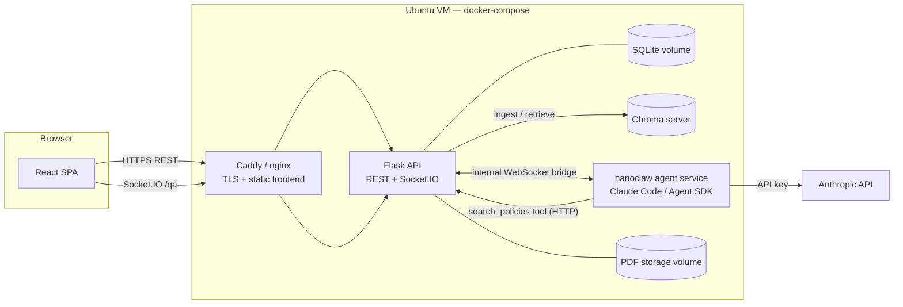
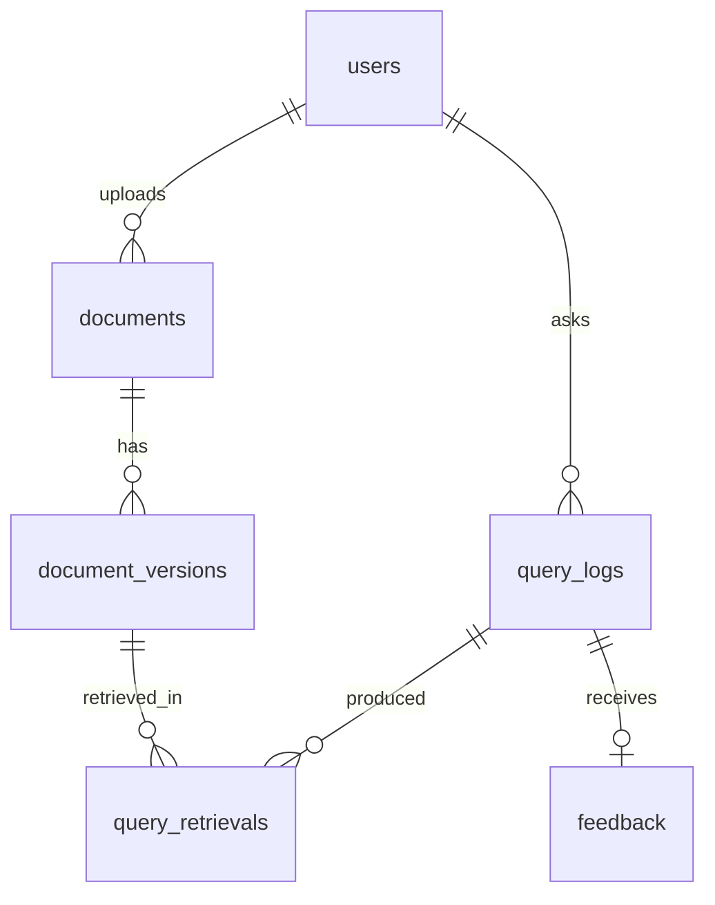

# Implementation Plan — University Policy RAG Platform

Companion to [objectives.md](objectives.md). Written 2026-08-05. Plans the full 9-week build, objective by objective, plus the API, WebSocket, database, and RAG designs.

## 1. Decisions and constraints

Recorded so later work doesn't re-litigate them:

| Decision | Choice |
|---|---|
| Backend | Flask (Python) REST API + Flask-SocketIO |
| RAG agent | nanoclaw running Claude Code (Claude Agent SDK) in a container, authenticated with a server-side **Anthropic API key** |
| Answering model | `claude-opus-5` ($5 / $25 per MTok). Cost levers if needed: `claude-sonnet-5` ($3/$15, intro $2/$10 through 2026-08-31), `claude-haiku-4-5` ($1/$5) |
| Embeddings | Chroma built-in local model (all-MiniLM-L6-v2, free, offline). Upgrade path: Voyage AI or another hosted embedding API if benchmark precision falls short |
| Vector store | Chroma (server container, persistent volume) |
| Relational DB | SQLite via SQLAlchemy (swap to Postgres later without code changes if ever needed) |
| Frontend | React (Vite) SPA |
| Realtime | Socket.IO between React and Flask; a second internal WebSocket bridges Flask ↔ nanoclaw |
| Auth | JWT (flask-jwt-extended); accounts for everyone — roles `student` and `admin` |
| Deployment | Single Ubuntu cloud VM, docker-compose, Caddy (or nginx) for TLS |
| Dev machine | Windows 10 + Docker Desktop (WSL2) — same compose file runs locally and on the VM |

## 2. System architecture



Flow of one question:

1. Student sends `ask` over Socket.IO. Flask creates a `query_logs` row (status `pending`), forwards `{type:"ask"}` over the internal bridge to nanoclaw.
2. nanoclaw runs a Claude Code agent turn. The agent's only tool is `search_policies` — an HTTP call back to Flask's internal retrieval endpoint, which embeds the query and searches Chroma. The agent may search more than once (query reformulation).
3. Every retrieval is recorded in `query_retrievals`. Agent output streams back over the bridge; Flask relays tokens to the student's socket.
4. On completion the agent returns a structured final message (answer, citations, `answered` flag). Flask computes the confidence score from cited-chunk similarities, finalizes the `query_logs` row, emits `answer` to the client.

Ingestion (upload → text extraction → chunking → embedding → Chroma) lives entirely in Flask; the agent only reads.

**De-risk note on nanoclaw:** nanoclaw is WhatsApp-first — the integration work is implementing a custom channel that speaks our internal WebSocket bridge instead. If its channel layer resists this, the fallback is a small Node service that calls the Claude Agent SDK (`@anthropic-ai/claude-agent-sdk`) directly with the same bridge protocol — the rest of the system is unchanged either way, because everything talks to the bridge contract in §5.3, not to nanoclaw itself.

## 3. Objective-by-objective plan

### Objective 1 — Centralized policy repository (Week 1)

**Goal:** platform hosts ≥30 policy PDFs with upload and storage.

| # | Task | Notes |
|---|---|---|
| 1.1 | Repo scaffolding | Monorepo: `backend/`, `frontend/`, `agent/`, `docker-compose.yml`, `.env.example` |
| 1.2 | Flask app factory, SQLAlchemy models, Flask-Migrate | Tables from §6 (users, documents, document_versions now; the rest migrate in later) |
| 1.3 | Auth: register, login, JWT, role field | Seed one admin account via CLI command |
| 1.4 | PDF upload + storage | Multipart upload, validate `application/pdf`, 25 MB cap, store under `data/pdfs/{document_id}/v{n}.pdf`, sha256 hash |
| 1.5 | Document list/detail/file endpoints | §4.2 |
| 1.6 | React shell | Vite + router; pages: Login/Register, Policy Library (search/filter by category), PDF viewer (iframe or react-pdf) |
| 1.7 | Seed corpus | Bulk-upload script; load ≥30 real policy PDFs |

**Done when:** an authenticated user can browse and open all 30+ policies in the browser.

### Objective 2 — Administration module (Week 2)

**Goal:** admin can add, replace (version), and archive policies end to end.

| # | Task | Notes |
|---|---|---|
| 2.1 | Role-gated admin API | `@admin_required` decorator; 403 for students |
| 2.2 | Add policy | Same upload path as 1.4 exposed in admin UI with metadata form |
| 2.3 | Replace version | New `document_versions` row, `version_number` +1, document points at new current version; old file retained for audit |
| 2.4 | Archive / restore | `status` flip; archived policies hidden from student library and (from Week 3) removed from the Chroma index |
| 2.5 | Admin UI | Documents table with actions: upload, replace, archive, view versions |
| 2.6 | Audit trail | `uploaded_by` on every version; simple activity list on the admin dashboard |

**Done when:** an admin performs add → replace → archive on a test policy entirely through the UI.

### Objective 3 — RAG pipeline (Weeks 3–4)

**Goal:** natural-language Q&A with citations; ≥80% top-k retrieval precision on a 50-question benchmark.

Week 3 — ingestion + retrieval:

| # | Task | Notes |
|---|---|---|
| 3.1 | Chroma container + client wiring | Collection `policies`; persistent volume |
| 3.2 | Text extraction | `pypdf` first, fall back to `pdfplumber` for stubborn layouts; store page boundaries |
| 3.3 | Chunking | ~800-token chunks, 15% overlap, never split mid-sentence; metadata: `document_id`, `version_id`, `title`, `page`, `chunk_index` |
| 3.4 | Index on upload + backfill command | Version replace = delete old version's chunks, index new; archive = delete chunks. `index_status` tracked per version |
| 3.5 | Internal retrieval endpoint | `POST /internal/retrieve` (§4.6): embed query, top-k (default 6) with similarities |

Week 4 — agent + chat:

| # | Task | Notes |
|---|---|---|
| 3.6 | nanoclaw service | Container with `ANTHROPIC_API_KEY`; custom channel speaking the bridge protocol (§5.3); model `claude-opus-5`; concurrency cap (default 3), Flask queues beyond that |
| 3.7 | Agent system prompt + `search_policies` tool | Prompt: answer only from retrieved policy text, cite every claim as [n], say so explicitly when policies don't cover the question and set `answered:false`. Tool = HTTP call to 3.5 |
| 3.8 | Socket.IO Q&A flow | Events in §5.2, streaming tokens end to end |
| 3.9 | Chat UI | Chat page: streamed answer, citation chips linking to the PDF at the cited page, sources panel, confidence badge |
| 3.10 | Sync endpoint `POST /api/v1/ask` | Same pipeline, blocks until done — used by the benchmark harness and as a non-WS fallback |
| 3.11 | Benchmark harness | `eval/benchmark.py`: 50 questions + expected source document(s); computes top-k retrieval precision, answer-citation accuracy; outputs JSON + markdown report |
| 3.12 | Tuning loop | If <80%: adjust chunk size/overlap, k, add title-prefixing to chunks; last resort switch embedding model (Voyage) — decision gate end of Week 4 |

**Done when:** benchmark reports ≥80% top-k retrieval precision and streamed cited answers work in the UI.

### Objective 4 — Pilot deployment + query logging (Weeks 5–6)

**Goal:** ≥20 real users for two weeks; every query logged; ≥200 logged queries.

| # | Task | Notes |
|---|---|---|
| 4.1 | Complete QueryLog wiring | Every path (WS + `/ask`) writes text, timestamp, retrievals, confidence, status incl. `unanswered`, latency, token usage |
| 4.2 | Provision VM | Ubuntu 22.04+, Docker, compose; DNS + TLS via Caddy |
| 4.3 | Production compose | Restart policies, resource limits, volumes for SQLite/Chroma/PDFs; env-file secrets; API key never in the image |
| 4.4 | Safeguards | Per-user rate limit (e.g. 10 questions/hour), Anthropic spend alert, request size limits |
| 4.5 | Backups | Nightly cron: SQLite file + Chroma volume + PDFs → tarball, keep 14 days |
| 4.6 | Onboarding | Recruit ≥20 users, one-page guide, consent note that queries are logged for research |
| 4.7 | Pilot operations | Monitor logs/disk/spend; hotfix channel; weekly checkpoint on query volume vs. 200 target |

**Done when:** two-week window closes with ≥200 logged queries from ≥20 distinct users.

### Objective 5 — Analysis & evaluation report (Weeks 7–9)

**Goal:** evaluation report with accuracy metrics and policy-ambiguity charts for leadership.

| # | Task | Notes |
|---|---|---|
| 5.1 | Analytics API (§4.4) | Summary stats, top queries, unanswered, low-confidence, per-document demand |
| 5.2 | Admin analytics dashboard | Charts: query volume over time, answered vs unanswered, confidence distribution, most-queried policies, most-ambiguous policies (high query volume + low mean confidence / repeated reformulations) |
| 5.3 | CSV export | Query logs + retrievals for offline analysis |
| 5.4 | Re-run benchmark on pilot data | Retrieval accuracy on real queries (manual relevance labels on a sample) vs. the synthetic 50 |
| 5.5 | Ambiguity analysis | Cluster unanswered/low-confidence queries (embedding clustering over query texts); map clusters to policies or gaps |
| 5.6 | Evaluation report | Method, metrics, charts, findings, recommendations to leadership; final write-up for the project document |

**Done when:** report delivered; dashboard demonstrates the same numbers live.

## 4. REST API specification

Base path `/api/v1`. JSON everywhere except file upload (multipart) and file download. Auth: `Authorization: Bearer <JWT>`. Errors share one shape:

```json
{ "error": { "code": "not_found", "message": "Document 42 does not exist" } }
```

Codes: `validation_error` (400), `unauthorized` (401), `forbidden` (403), `not_found` (404), `conflict` (409), `rate_limited` (429), `server_error` (500).

### 4.1 Auth

| Method + path | Body | Returns |
|---|---|---|
| `POST /auth/register` | `{name, email, password}` | `201 {user, access_token}` |
| `POST /auth/login` | `{email, password}` | `{user, access_token}` |
| `GET /auth/me` | — | `{user}` |

`user` object: `{id, name, email, role, created_at}`.

### 4.2 Documents (any authenticated user)

| Method + path | Params | Returns |
|---|---|---|
| `GET /documents` | `?q=&category=&status=active&page=&per_page=` | `{items: [DocumentSummary], total, page, per_page}` |
| `GET /documents/:id` | — | `Document` (includes `versions[]`) |
| `GET /documents/:id/file` | `?version=` (default current) | PDF bytes, `Content-Disposition: inline` |
| `GET /documents/categories` | — | `{categories: [string]}` |

```json
// DocumentSummary
{ "id": 1, "title": "Examination Policy", "category": "Academic",
  "status": "active", "current_version": 2, "updated_at": "2026-08-01T09:00:00Z" }

// Document adds:
{ "versions": [ { "id": 7, "version_number": 2, "page_count": 14,
    "uploaded_at": "...", "uploaded_by": "Jane Admin",
    "index_status": "indexed", "chunk_count": 45 } ] }
```

### 4.3 Admin — repository maintenance (role: admin)

| Method + path | Body | Returns |
|---|---|---|
| `POST /admin/documents` | multipart: `file`, `title`, `category`, `effective_date?` | `201 Document` (ingestion queued) |
| `POST /admin/documents/:id/versions` | multipart: `file`, `effective_date?` | `201 Document` (new current version, reindex queued) |
| `PATCH /admin/documents/:id` | `{title?, category?, status?}` (`status: "archived"` = archive, `"active"` = restore) | `Document` |
| `GET /admin/documents/:id/index-status` | — | `{version_id, index_status, chunk_count, error?}` |

### 4.4 Admin — logs & analytics (role: admin)

| Method + path | Params | Returns |
|---|---|---|
| `GET /admin/query-logs` | `?from=&to=&status=&user_id=&page=&format=csv` | paginated `QueryLog[]` or CSV |
| `GET /admin/analytics/summary` | `?from=&to=` | `{total_queries, distinct_users, answered, unanswered, error, avg_confidence, avg_response_ms, queries_per_day: [{date, count}]}` |
| `GET /admin/analytics/top-queries` | `?limit=20` | `[{query_cluster_label, count, avg_confidence, example_queries[]}]` |
| `GET /admin/analytics/documents` | — | `[{document_id, title, times_retrieved, times_cited, avg_similarity}]` |
| `GET /admin/analytics/ambiguous` | `?limit=20` | `[{document_id, title, low_confidence_queries, mean_confidence, sample_queries[]}]` |

### 4.5 Queries (student-facing)

| Method + path | Body | Returns |
|---|---|---|
| `POST /ask` | `{question}` | `AnswerResult` (synchronous; used by benchmark + fallback) |
| `GET /queries/mine` | `?page=` | user's past `{question, answer, confidence, created_at, citations}` |
| `POST /queries/:log_id/feedback` | `{rating: "up"\|"down", comment?}` | `204` |

```json
// AnswerResult — the same shape the WebSocket `answer` event carries
{
  "log_id": 314,
  "question": "How many CATs contribute to my final grade?",
  "answered": true,
  "answer_md": "Continuous assessment contributes 30% ... [1] ... [2]",
  "citations": [
    { "n": 1, "document_id": 4, "title": "Examination Policy",
      "version_id": 9, "page": 3, "chunk_id": "doc4_v9_c12", "similarity": 0.83 }
  ],
  "confidence": 0.79,
  "response_ms": 6120,
  "model": "claude-opus-5"
}
```

`answer_md` is markdown with inline `[n]` markers matching `citations[].n` — the frontend renders markers as clickable chips that open `GET /documents/:id/file` at the cited page.

### 4.6 Internal (not exposed publicly; compose-network only, shared-secret header)

| Method + path | Body | Returns |
|---|---|---|
| `POST /internal/retrieve` | `{query, k: 6, query_id}` | `{chunks: [{chunk_id, document_id, version_id, title, page, text, similarity}]}` — also inserts `query_retrievals` rows |

This endpoint is the agent's `search_policies` tool. Only `status=active` documents' current versions are searchable.

## 5. WebSocket specification

### 5.1 Transport

Socket.IO (works through proxies, auto-reconnect, fallback polling). Namespace `/qa`. Client authenticates at connect: `io("/qa", { auth: { token: JWT } })`; invalid token → `connect_error`.

### 5.2 Client ↔ Flask events

Client → server:

| Event | Payload | Notes |
|---|---|---|
| `ask` | `{question: string, client_ref: string}` | `client_ref` is a client-generated id so the UI can match the ack |
| `cancel` | `{query_id}` | best-effort abort |

Server → client (all carry `query_id`):

| Event | Payload | When |
|---|---|---|
| `query_accepted` | `{query_id, client_ref}` | immediately; UI swaps client_ref → query_id |
| `status` | `{query_id, stage: "queued"\|"retrieving"\|"generating"}` | stage transitions; drives the typing indicator |
| `sources` | `{query_id, sources: [{chunk_id, document_id, title, page, similarity}]}` | after each `search_policies` call (may fire more than once; cumulative) |
| `token` | `{query_id, text}` | streamed answer fragments; append in order |
| `answer` | `AnswerResult` (§4.5) | final; replaces streamed text with the canonical answer + citations |
| `error` | `{query_id, code: "agent_timeout"\|"agent_error"\|"rate_limited"\|"cancelled", message}` | terminal failure; UI offers retry |

Contract: a query terminates with exactly one `answer` **or** one `error`. `token` events may be dropped by the client with no loss — `answer.answer_md` is always the complete text (that's why the frontend can rely on it after a reconnect).

### 5.3 Internal bridge protocol (Flask ↔ nanoclaw)

Plain WebSocket, JSON messages, nanoclaw connects out to Flask (`/internal/agent-bridge`) with a shared secret; Flask re-queues jobs if the bridge drops.

Flask → agent: `{"type": "ask", "query_id": 314, "question": "...", "user_role": "student"}`
Agent → Flask:

| `type` | Fields | Maps to client event |
|---|---|---|
| `accepted` | `query_id` | `status: generating` |
| `tool_use` | `query_id, tool: "search_policies", input: {query, k}` | `status: retrieving` (Flask already sees the retrieval via §4.6 and emits `sources`) |
| `token` | `query_id, text` | `token` |
| `final` | `query_id, answered: bool, answer_md, citations: [{n, chunk_id}]` | Flask joins citations against the retrieval rows to build full citation objects, computes confidence, writes the log, emits `answer` |
| `error` | `query_id, code, message` | `error` |
| `ping` / `pong` | — | heartbeat every 20s |

Timeout: 120s per query; on expiry Flask emits `error {code:"agent_timeout"}` and marks the log row `error`.

**Confidence score** (computed by Flask, stored on the log): mean similarity of the chunks actually cited in `final.citations` (0–1). `answered:false` from the agent, or confidence < 0.35, marks the query `unanswered` — the dataset objective 5 mines for policy gaps.

## 6. Database design

SQLite file `data/app.db`, SQLAlchemy models, Flask-Migrate migrations. Chroma holds vectors only; SQL is the source of truth.



```sql
users (
  id INTEGER PK,
  name TEXT NOT NULL,
  email TEXT NOT NULL UNIQUE,
  password_hash TEXT NOT NULL,
  role TEXT NOT NULL CHECK (role IN ('student','admin')) DEFAULT 'student',
  created_at DATETIME NOT NULL,
  last_login_at DATETIME
)

documents (
  id INTEGER PK,
  title TEXT NOT NULL,
  category TEXT NOT NULL,
  status TEXT NOT NULL CHECK (status IN ('active','archived')) DEFAULT 'active',
  current_version_id INTEGER FK -> document_versions.id,
  created_by INTEGER FK -> users.id,
  created_at DATETIME NOT NULL,
  updated_at DATETIME NOT NULL
)

document_versions (
  id INTEGER PK,
  document_id INTEGER FK NOT NULL,
  version_number INTEGER NOT NULL,          -- (document_id, version_number) UNIQUE
  file_path TEXT NOT NULL,
  file_sha256 TEXT NOT NULL,
  page_count INTEGER,
  effective_date DATE,
  uploaded_by INTEGER FK -> users.id,
  uploaded_at DATETIME NOT NULL,
  index_status TEXT NOT NULL CHECK (index_status IN
      ('pending','indexing','indexed','failed')) DEFAULT 'pending',
  chunk_count INTEGER,
  index_error TEXT
)

query_logs (                                 -- the QueryLog table from objective 4
  id INTEGER PK,
  user_id INTEGER FK -> users.id,
  query_text TEXT NOT NULL,
  created_at DATETIME NOT NULL,              -- timestamp
  status TEXT NOT NULL CHECK (status IN
      ('pending','answered','unanswered','error','cancelled')),
  answer_text TEXT,
  confidence REAL,                           -- 0–1, NULL until final
  response_ms INTEGER,
  model TEXT,
  input_tokens INTEGER,
  output_tokens INTEGER,
  error_code TEXT
)

query_retrievals (                           -- "retrieved documents" per query
  id INTEGER PK,
  query_log_id INTEGER FK NOT NULL,
  document_id INTEGER FK NOT NULL,
  document_version_id INTEGER FK NOT NULL,
  chunk_id TEXT NOT NULL,                    -- Chroma id: doc{d}_v{v}_c{i}
  page INTEGER,
  rank INTEGER NOT NULL,                     -- position in that retrieval call
  similarity REAL NOT NULL,
  cited BOOLEAN NOT NULL DEFAULT 0           -- set when it appears in final citations
)

feedback (
  id INTEGER PK,
  query_log_id INTEGER FK NOT NULL UNIQUE,
  user_id INTEGER FK NOT NULL,
  rating TEXT NOT NULL CHECK (rating IN ('up','down')),
  comment TEXT,
  created_at DATETIME NOT NULL
)
```

Indexes: `query_logs(created_at)`, `query_logs(user_id)`, `query_logs(status)`, `query_retrievals(query_log_id)`, `query_retrievals(document_id)`, `document_versions(document_id)`.

**Chroma collection `policies`** — one entry per chunk:
`id = "doc{document_id}_v{version_id}_c{chunk_index}"`, `document = chunk text`, `metadata = {document_id, version_id, title, category, page, chunk_index}`. Replacing a version deletes `where {version_id: old}` then adds new; archiving deletes `where {document_id}`.

## 7. RAG pipeline details

- **Extraction:** `pypdf` per page → normalize whitespace → keep page numbers for citation mapping.
- **Chunking:** ~800 tokens, 15% overlap, sentence-boundary aware; each chunk prefixed with `"{title} — page {n}:"` so the embedding carries document identity (cheap precision win).
- **Retrieval:** cosine similarity, top-k = 6 default (benchmark tunes k).
- **Agent contract:** system prompt pins behavior — answer only from tool results; every factual sentence carries a `[n]` citation; if the retrieved text doesn't answer the question, say so and return `answered:false`; refuse to answer non-policy questions. Final turn must be the structured `final` JSON (§5.3).
- **Prompt caching:** the agent's system prompt is stable → cached across queries; per-query content (question, chunks) comes last. Keeps per-query input cost low.
- **Cost estimate:** ~3–6K input + ~500 output tokens per query → roughly $0.02–0.05 per query on `claude-opus-5`; a 200-query pilot ≈ **$5–10** plus development usage. A billing alert at $25 (4.4) covers surprises. Dropping to Sonnet 5 or Haiku 4.5 is a one-line env change if spend or latency argues for it.
- **Benchmark metric (objective 3):** for each of 50 questions with labeled source documents, retrieval is a hit if a labeled document appears in top-k. Precision = hits/50 ≥ 0.80. Secondary metrics: citation accuracy (cited doc is a labeled doc) and unanswered false-positive rate.

## 8. Deployment layout

```yaml
# docker-compose.yml (shape, not final)
services:
  caddy:      # TLS, serves frontend build, proxies /api and /socket.io to flask
  flask:      # gunicorn + eventlet (Socket.IO), mounts data/ volume
  chroma:     # chromadb server, volume chroma-data
  nanoclaw:   # agent service, env: ANTHROPIC_API_KEY, BRIDGE_URL, BRIDGE_SECRET
volumes: [app-data, chroma-data, caddy-data]
```

Secrets in `.env` on the VM only (never committed). Local dev on Windows runs the same compose via Docker Desktop; `npm run dev` (Vite) proxies to Flask for hot reload.

## 9. Risks & mitigations

| Risk | Mitigation |
|---|---|
| Local embeddings miss the 80% precision target | Decision gate end of Week 4: tune chunking/k first, then swap to a hosted embedding model (Voyage) — retrieval endpoint isolates the change |
| nanoclaw channel adaptation harder than expected | Bridge protocol is the contract; fallback to a thin Claude Agent SDK Node service (§2) without touching Flask or React |
| API spend surprise | Billing alert, per-user rate limit, token usage logged per query |
| Pilot volume short of 200 queries | Weekly checkpoint (4.7); mid-pilot nudge/reminders; extend window a few days if needed (timeline has slack in weeks 7–9) |
| SQLite write contention | Fine at this scale (single writer, WAL mode); SQLAlchemy keeps Postgres as an escape hatch |
| PDF extraction failures on scanned policies | `index_status=failed` surfaces in admin UI; scanned docs are out of scope unless OCR is added later |

## 10. Immediate next steps

1. Scaffold the monorepo + compose file (task 1.1) and commit.
2. Get an Anthropic API key into `.env` and verify a hello-world Agent SDK call from the nanoclaw container.
3. Collect the 30-policy seed corpus in parallel — it gates Objective 1's success measure.
