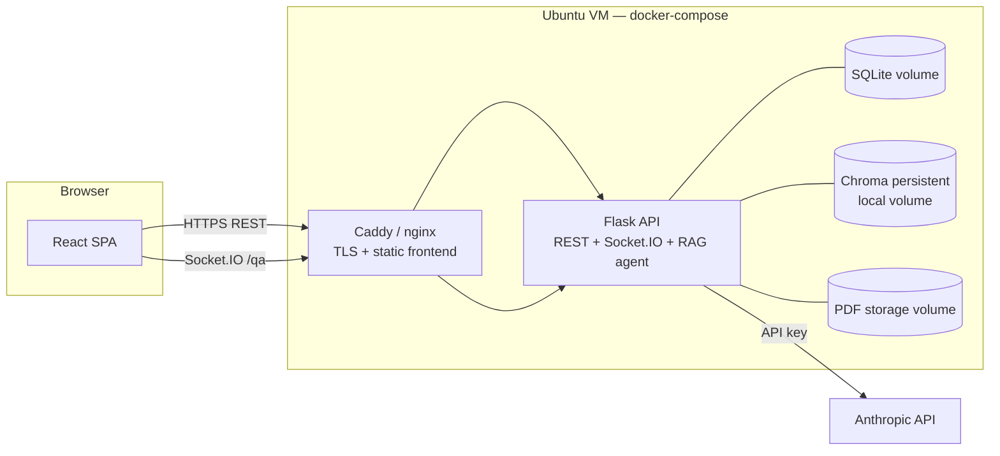
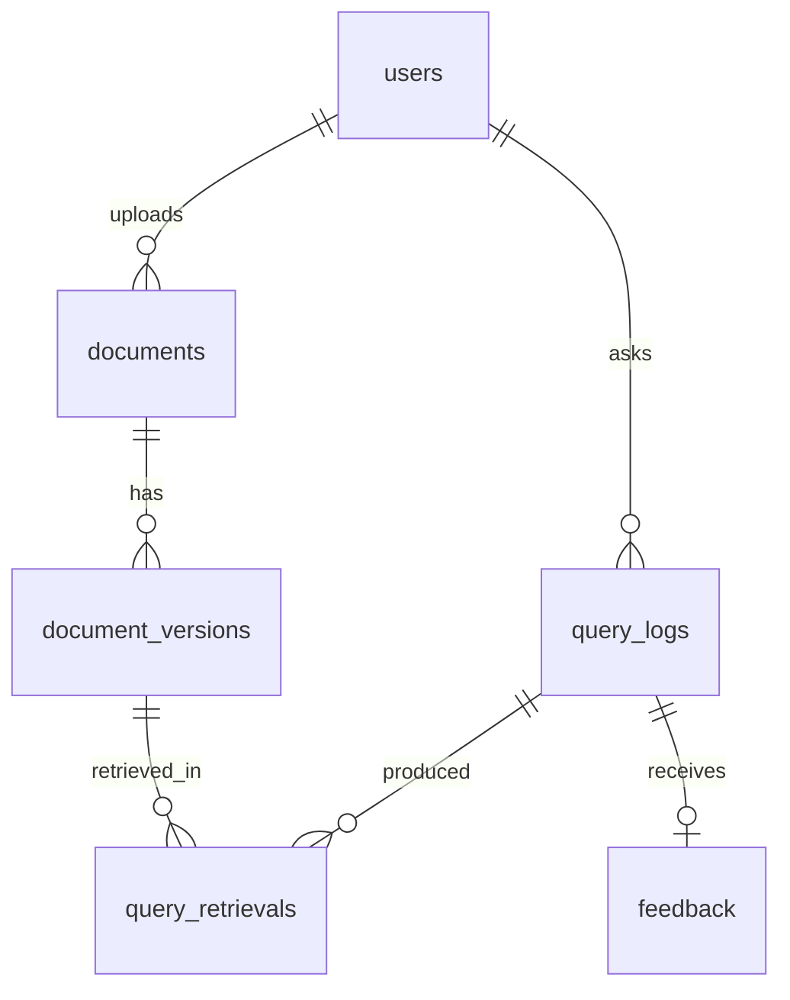

# Implementation Plan — University Policy RAG Platform

Companion to [objectives.md](objectives.md). Written 2026-08-05. Plans the full 9-week build, objective by objective, plus the API, WebSocket, database, and RAG designs.

## 1. Decisions and constraints

Recorded so later work doesn't re-litigate them:

| Decision | Choice |
|---|---|
| Backend | Flask (Python) REST API + Flask-SocketIO |
| RAG agent | `anthropic` Python SDK tool-use loop (`client.beta.messages.tool_runner`) running in-process inside Flask on a worker thread, authenticated with a server-side **Anthropic API key**. Deliberately *not* the Claude Agent SDK — that is a separate product (Claude Code packaged as a library, shipping built-in file/bash/web tools and a Node CLI subprocess), which is the wrong shape and the wrong dependency weight for a loop with one tool |
| Answering model | `claude-opus-5` ($5 / $25 per MTok). Thinking stays **on** (see §8.5); `output_config.effort` is tuned against the Week 4 benchmark. Cost levers if needed: `claude-sonnet-5` ($3/$15, intro $2/$10 through 2026-08-31), `claude-haiku-4-5` ($1/$5) |
| Embeddings | Chroma built-in local model (all-MiniLM-L6-v2, free, offline). Upgrade path: Voyage AI or another hosted embedding API if benchmark precision falls short |
| Vector store | Chroma embedded persistent client (local volume, no separate server process). Swap to a Chroma server or hosted vector DB later without code changes if ever needed |
| Relational DB | SQLite via SQLAlchemy, WAL mode (swap to Postgres later without code changes if ever needed) |
| Frontend | React (Vite) SPA |
| Realtime | Socket.IO between React and Flask. The RAG agent runs in-process, so there's no second internal bridge to build or operate |
| Concurrency model | **One** gunicorn worker, `gthread` worker class, ~8 threads. Forced independently by two constraints: Socket.IO needs a single worker unless you add a Redis message queue, and Chroma's persistent client is single-process. Explicitly **not** eventlet — the embedding model is CPU-bound native code that would stall every greenlet in the process (§8.2) |
| Auth | JWT (flask-jwt-extended); accounts for everyone — roles `student` and `admin` |
| Deployment | Single Ubuntu cloud VM, docker-compose, Caddy (or nginx) for TLS |
| Host sizing | 2 vCPU / 4 GB RAM + 2 GB swap. The peak load is PDF ingestion, not query serving (§8.1) |
| Dev machine | Windows 10 + Docker Desktop (WSL2) — same compose file runs locally and on the VM; repo lives inside the WSL2 filesystem (§8.6) |

## 2. System architecture



Flow of one question:

1. Student sends `ask` over Socket.IO. Flask creates a `query_logs` row (status `pending`) and starts the tool-use loop on a worker thread, keeping the request non-blocking.
2. The agent's only tool is `search_policies` — a direct in-process call to the retrieval function (§4.6), which embeds the query and searches Chroma. The agent may call it more than once (query reformulation).
3. Every retrieval is recorded in `query_retrievals`. As the agent streams tokens, Flask relays them straight to the student's socket — no intermediate protocol to translate.
4. On completion the agent returns a structured final message (answer, citations, `answered` flag). Flask computes the confidence score from cited-chunk similarities, finalizes the `query_logs` row, emits `answer` to the client.

Ingestion (upload → text extraction → chunking → embedding → Chroma) and the agent both run inside Flask; ingestion writes, the agent only reads. The two compete for the same CPU, which is why ingestion is serialized behind a single-worker queue (§8.3).

**Why in-process:** the platform is a web app only — the browser is the sole client, so there is no need for a separate agent service or an internal protocol between processes. The loop has exactly one tool, so the `anthropic` SDK's tool runner covers it in a few dozen lines: define `search_policies`, hand it to `client.beta.messages.tool_runner(...)`, and iterate. That leaves two containers to operate and one Python dependency to install.

## 3. Objective-by-objective plan

### Objective 1 — Centralized policy repository (Week 1)

**Goal:** platform hosts ≥30 policy PDFs with upload and storage.

| # | Task | Notes |
|---|---|---|
| 1.1 | Repo scaffolding | Monorepo: `backend/`, `frontend/`, `docker-compose.yml`, `.env.example` — the RAG agent lives inside `backend/` (e.g. `backend/app/agent.py`) |
| 1.2 | Flask app factory, SQLAlchemy models, Flask-Migrate | Tables from §6 (users, documents, document_versions now; the rest migrate in later) |
| 1.3 | Auth: register, login, JWT, role field | Seed one admin account via CLI command |
| 1.4 | PDF upload + storage | Multipart upload, validate `application/pdf`, 25 MB cap, store under `data/pdfs/{document_id}/v{n}.pdf`, sha256 hash |
| 1.5 | Document list/detail/file endpoints | §4.2 |
| 1.6 | React shell | Vite + router; pages: Login/Register, Policy Library (search/filter by category), PDF viewer (iframe or react-pdf) |
| 1.7 | Seed corpus | Bulk-upload script; load ≥30 real policy PDFs |

**Done when:** an authenticated user can browse and open all 30+ policies in the browser.

### Objective 2 — Administration module (Week 2)

**Goal:** admin can add, replace (version), and archive policies end to end.

| # | Task | Notes |
|---|---|---|
| 2.1 | Role-gated admin API | `@admin_required` decorator; 403 for students |
| 2.2 | Add policy | Same upload path as 1.4 exposed in admin UI with metadata form |
| 2.3 | Replace version | New `document_versions` row, `version_number` +1, document points at new current version; old file retained for audit |
| 2.4 | Archive / restore | `status` flip; archived policies hidden from student library and (from Week 3) removed from the Chroma index |
| 2.5 | Admin UI | Documents table with actions: upload, replace, archive, view versions |
| 2.6 | Audit trail | `uploaded_by` on every version; simple activity list on the admin dashboard |

**Done when:** an admin performs add → replace → archive on a test policy entirely through the UI.

### Objective 3 — RAG pipeline (Weeks 3–4)

**Goal:** natural-language Q&A with citations; ≥80% top-k retrieval precision on a 50-question benchmark.

Week 3 — ingestion + retrieval:

| # | Task | Notes |
|---|---|---|
| 3.1 | Chroma client wiring | Embedded persistent client (no separate container); collection `policies`; data dir on the app-data volume |
| 3.2 | Text extraction | `pypdf` first, fall back to `pdfplumber` for stubborn layouts; store page boundaries |
| 3.3 | Chunking | ~800-token chunks, 15% overlap, never split mid-sentence; metadata: `document_id`, `version_id`, `title`, `page`, `chunk_index` |
| 3.4 | Index on upload + backfill command | Version replace = delete old version's chunks, index new; archive = delete chunks. `index_status` tracked per version |
| 3.5 | Internal retrieval function | `retrieve()` (§4.6): embed query, top-k (default 6) with similarities |

Week 4 — agent + chat:

| # | Task | Notes |
|---|---|---|
| 3.6 | Agent integration | `anthropic` SDK tool runner inside Flask; `ANTHROPIC_API_KEY` in env; model `claude-opus-5`; concurrency cap (default 3) via a semaphore, Flask queues beyond that |
| 3.7 | Agent system prompt + `search_policies` tool | Prompt: answer only from retrieved policy text, cite every claim as [n], say so explicitly when policies don't cover the question and set `answered:false`. Tool = direct call to the retrieval function (3.5) |
| 3.8 | Socket.IO Q&A flow | Events in §5.2, streaming tokens end to end; Flask emits directly from the agent loop, no bridge to relay through |
| 3.9 | Chat UI | Chat page: streamed answer, citation chips linking to the PDF at the cited page, sources panel, confidence badge |
| 3.10 | Sync endpoint `POST /api/v1/ask` | Same pipeline, blocks until done — used by the benchmark harness and as a non-WS fallback |
| 3.11 | Benchmark harness | `eval/benchmark.py`: 50 questions + expected source document(s); computes top-k retrieval precision, answer-citation accuracy; outputs JSON + markdown report |
| 3.12 | Tuning loop | If <80%: adjust chunk size/overlap, k, add title-prefixing to chunks; last resort switch embedding model (Voyage) — decision gate end of Week 4 |
| 3.13 | Effort sweep | Re-run the 3.11 benchmark at `effort` = `low` / `medium` / `high`, recording answer quality, latency, and tokens per question. Pick the cheapest level that holds quality; this is the main cost and latency lever (§8.5) |

**Done when:** benchmark reports ≥80% top-k retrieval precision and streamed cited answers work in the UI.

### Objective 4 — Pilot deployment + query logging (Weeks 5–6)

**Goal:** ≥20 real users for two weeks; every query logged; ≥200 logged queries.

| # | Task | Notes |
|---|---|---|
| 4.1 | Complete QueryLog wiring | Every path (WS + `/ask`) writes text, timestamp, retrievals, confidence, status incl. `unanswered`, latency, token usage |
| 4.2 | Provision VM | Ubuntu 22.04+, Docker, compose; DNS + TLS via Caddy |
| 4.3 | Production compose | Restart policies, resource limits, volumes for SQLite/Chroma/PDFs; env-file secrets; API key never in the image |
| 4.4 | Safeguards | Per-user rate limit (e.g. 10 questions/hour), Anthropic spend alert, request size limits |
| 4.5 | Backups | Nightly cron: SQLite file + Chroma volume + PDFs → tarball, keep 14 days |
| 4.6 | Onboarding | Recruit ≥20 users, one-page guide, consent note that queries are logged for research |
| 4.7 | Pilot operations | Monitor logs/disk/spend; hotfix channel; weekly checkpoint on query volume vs. 200 target |

**Done when:** two-week window closes with ≥200 logged queries from ≥20 distinct users.

### Objective 5 — Analysis & evaluation report (Weeks 7–9)

**Goal:** evaluation report with accuracy metrics and policy-ambiguity charts for leadership.

| # | Task | Notes |
|---|---|---|
| 5.1 | Analytics API (§4.4) | Summary stats, top queries, unanswered, low-confidence, per-document demand |
| 5.2 | Admin analytics dashboard | Charts: query volume over time, answered vs unanswered, confidence distribution, most-queried policies, most-ambiguous policies (retrieved-often-but-cited-rarely, plus reformulation chains via `session_id` — see §4.4) |
| 5.3 | CSV export | Query logs + retrievals for offline analysis |
| 5.4 | Re-run benchmark on pilot data | Retrieval accuracy on real queries (manual relevance labels on a sample) vs. the synthetic 50 |
| 5.5 | Ambiguity analysis | Cluster unanswered/low-confidence queries (embedding clustering over query texts); map clusters to policies or gaps. Run offline as a script, not in a request — it re-embeds every query and would peg the VM (§8.1) |
| 5.6 | Evaluation report | Method, metrics, charts, findings, recommendations to leadership; final write-up for the project document |

**Done when:** report delivered; dashboard demonstrates the same numbers live.

## 4. REST API specification

Base path `/api/v1`. JSON everywhere except file upload (multipart) and file download. Auth: `Authorization: Bearer <JWT>`. Errors share one shape:

```json
{ "error": { "code": "not_found", "message": "Document 42 does not exist" } }
```

Codes: `validation_error` (400), `unauthorized` (401), `forbidden` (403), `not_found` (404), `conflict` (409), `rate_limited` (429), `server_error` (500).

### 4.1 Auth

| Method + path | Body | Returns |
|---|---|---|
| `POST /auth/register` | `{name, email, password}` | `201 {user, access_token}` |
| `POST /auth/login` | `{email, password}` | `{user, access_token}` |
| `GET /auth/me` | — | `{user}` |

`user` object: `{id, name, email, role, created_at}`.

### 4.2 Documents (any authenticated user)

| Method + path | Params | Returns |
|---|---|---|
| `GET /documents` | `?q=&category=&status=active&page=&per_page=` | `{items: [DocumentSummary], total, page, per_page}` |
| `GET /documents/:id` | — | `Document` (includes `versions[]`) |
| `GET /documents/:id/file` | `?version=` (default current) | PDF bytes, `Content-Disposition: inline` |
| `GET /documents/categories` | — | `{categories: [string]}` |

```json
// DocumentSummary
{ "id": 1, "title": "Examination Policy", "category": "Academic",
  "status": "active", "current_version": 2, "updated_at": "2026-08-01T09:00:00Z" }

// Document adds:
{ "versions": [ { "id": 7, "version_number": 2, "page_count": 14,
    "uploaded_at": "...", "uploaded_by": "Jane Admin",
    "index_status": "indexed", "chunk_count": 45 } ] }
```

### 4.3 Admin — repository maintenance (role: admin)

| Method + path | Body | Returns |
|---|---|---|
| `POST /admin/documents` | multipart: `file`, `title`, `category`, `effective_date?` | `201 Document` (ingestion queued) |
| `POST /admin/documents/:id/versions` | multipart: `file`, `effective_date?` | `201 Document` (new current version, reindex queued) |
| `PATCH /admin/documents/:id` | `{title?, category?, status?}` (`status: "archived"` = archive, `"active"` = restore) | `Document` |
| `GET /admin/documents/:id/index-status` | — | `{version_id, index_status, chunk_count, error?}` |

### 4.4 Admin — logs & analytics (role: admin)

| Method + path | Params | Returns |
|---|---|---|
| `GET /admin/query-logs` | `?from=&to=&status=&user_id=&page=&format=csv` | paginated `QueryLog[]` or CSV |
| `GET /admin/analytics/summary` | `?from=&to=` | `{total_queries, distinct_users, answered, unanswered, error, avg_confidence, avg_response_ms, queries_per_day: [{date, count}]}` |
| `GET /admin/analytics/top-queries` | `?limit=20` | `[{query_cluster_label, count, avg_confidence, example_queries[]}]` |
| `GET /admin/analytics/documents` | — | `[{document_id, title, times_retrieved, times_cited, avg_similarity}]` |
| `GET /admin/analytics/ambiguous` | `?limit=20` | `[{document_id, title, times_retrieved, times_cited, cite_rate, mean_similarity, unanswered_queries, sample_queries[]}]` |

**Why ambiguity is measured on retrievals, not on confidence.** Confidence is the mean similarity of the chunks the agent actually *cited* (§5.3), so an `unanswered` query cites nothing and has NULL confidence — the very queries that signal an ambiguous or missing policy would be invisible in a confidence-based per-document metric. `query_retrievals` rows exist regardless, including for unanswered queries, so ambiguity is computed from the gap between them: a policy that gets **retrieved often but cited rarely**, with low mean similarity, is one the retriever keeps surfacing and the model keeps finding unhelpful. That's the signal objective 5 wants, and it's available from data the pipeline already writes.

### 4.5 Queries (student-facing)

| Method + path | Body | Returns |
|---|---|---|
| `POST /ask` | `{question}` | `AnswerResult` (synchronous; used by benchmark + fallback) |
| `GET /queries/mine` | `?page=` | user's past `{question, answer, confidence, created_at, citations}` |
| `POST /queries/:log_id/feedback` | `{rating: "up"\|"down", comment?}` | `204` |

```json
// AnswerResult — the same shape the WebSocket `answer` event carries
{
  "log_id": 314,
  "question": "How many CATs contribute to my final grade?",
  "answered": true,
  "answer_md": "Continuous assessment contributes 30% ... [1] ... [2]",
  "citations": [
    { "n": 1, "document_id": 4, "title": "Examination Policy",
      "version_id": 9, "page": 3, "chunk_id": "doc4_v9_c12", "similarity": 0.83 }
  ],
  "confidence": 0.79,
  "response_ms": 6120,
  "model": "claude-opus-5"
}
```

`answer_md` is markdown with inline `[n]` markers matching `citations[].n` — the frontend renders markers as clickable chips that open `GET /documents/:id/file` at the cited page.

### 4.6 Internal retrieval (in-process function, not a route)

`retrieve(query: str, k: int = 6, query_id: int | None = None) -> [{chunk_id, document_id, version_id, title, page, text, similarity}]` — embeds the query, searches Chroma, and inserts `query_retrievals` rows. Called directly by the agent's `search_policies` tool, by `POST /ask`, and by the benchmark harness (3.11); no network hop or shared secret needed since it never leaves the process. Only `status=active` documents' current versions are searchable.

## 5. WebSocket specification

### 5.1 Transport

Socket.IO (works through proxies, auto-reconnect, fallback polling). Namespace `/qa`. Client authenticates at connect: `io("/qa", { auth: { token: JWT } })`; invalid token → `connect_error`.

### 5.2 Client ↔ Flask events

Client → server:

| Event | Payload | Notes |
|---|---|---|
| `ask` | `{question: string, client_ref: string}` | `client_ref` is a client-generated id so the UI can match the ack |
| `cancel` | `{query_id}` | best-effort abort |

Server → client (all carry `query_id`):

| Event | Payload | When |
|---|---|---|
| `query_accepted` | `{query_id, client_ref}` | immediately; UI swaps client_ref → query_id |
| `status` | `{query_id, stage: "queued"\|"retrieving"\|"generating"}` | stage transitions; drives the typing indicator |
| `sources` | `{query_id, sources: [{chunk_id, document_id, title, page, similarity}]}` | after each `search_policies` call (may fire more than once; cumulative) |
| `token` | `{query_id, text}` | streamed answer fragments; append in order |
| `answer` | `AnswerResult` (§4.5) | final; replaces streamed text with the canonical answer + citations |
| `error` | `{query_id, code: "agent_timeout"\|"agent_error"\|"rate_limited"\|"cancelled", message}` | terminal failure; UI offers retry |

Contract: a query terminates with exactly one `answer` **or** one `error`. `token` events may be dropped by the client with no loss — `answer.answer_md` is always the complete text (that's why the frontend can rely on it after a reconnect).

### 5.3 Agent loop → client events (internal)

The agent (an `anthropic` SDK tool-use loop) runs in the same Flask process as the Socket.IO server, so there's no wire protocol here — just a mapping from agent lifecycle to the client events in §5.2:

| Agent lifecycle | Maps to client event |
|---|---|
| loop starts | `status: generating` |
| `search_policies` tool call | `status: retrieving` (Flask already sees the retrieval via §4.6 and emits `sources`) |
| token from the model | `token` |
| final structured turn: `answered: bool, answer_md, citations: [{n, chunk_id}]` | Flask joins citations against the retrieval rows to build full citation objects, computes confidence, writes the log, emits `answer` |
| unhandled exception / API error | `error` |

Timeout: 120s per query; on expiry Flask cancels the loop, emits `error {code:"agent_timeout"}`, and marks the log row `error`.

**Confidence score** (computed by Flask, stored on the log): mean similarity of the chunks actually cited in the final answer's citations (0–1). `answered:false` from the agent, or confidence < 0.35, marks the query `unanswered` — the dataset objective 5 mines for policy gaps.

## 6. Database design

SQLite file `data/app.db`, SQLAlchemy models, Flask-Migrate migrations. Chroma holds vectors only; SQL is the source of truth.



```sql
users (
  id INTEGER PK,
  name TEXT NOT NULL,
  email TEXT NOT NULL UNIQUE,
  password_hash TEXT NOT NULL,
  role TEXT NOT NULL CHECK (role IN ('student','admin')) DEFAULT 'student',
  created_at DATETIME NOT NULL,
  last_login_at DATETIME
)

documents (
  id INTEGER PK,
  title TEXT NOT NULL,
  category TEXT NOT NULL,
  status TEXT NOT NULL CHECK (status IN ('active','archived')) DEFAULT 'active',
  current_version_id INTEGER FK -> document_versions.id,
  created_by INTEGER FK -> users.id,
  created_at DATETIME NOT NULL,
  updated_at DATETIME NOT NULL
)

document_versions (
  id INTEGER PK,
  document_id INTEGER FK NOT NULL,
  version_number INTEGER NOT NULL,          -- (document_id, version_number) UNIQUE
  file_path TEXT NOT NULL,
  file_sha256 TEXT NOT NULL,
  page_count INTEGER,
  effective_date DATE,
  uploaded_by INTEGER FK -> users.id,
  uploaded_at DATETIME NOT NULL,
  index_status TEXT NOT NULL CHECK (index_status IN
      ('pending','indexing','indexed','failed')) DEFAULT 'pending',
  chunk_count INTEGER,
  index_error TEXT
)

query_logs (                                 -- the QueryLog table from objective 4
  id INTEGER PK,
  user_id INTEGER FK -> users.id,
  session_id TEXT NOT NULL,                  -- client-generated per chat session;
                                             -- lets objective 5 detect reformulation
                                             -- chains (same user rephrasing the same
                                             -- question). Cannot be reconstructed
                                             -- after the fact — add it in Week 1.
  query_text TEXT NOT NULL,
  created_at DATETIME NOT NULL,              -- timestamp
  status TEXT NOT NULL CHECK (status IN
      ('pending','answered','unanswered','error','cancelled')),
  answer_text TEXT,
  confidence REAL,                           -- 0–1, NULL until final
  response_ms INTEGER,
  model TEXT,
  input_tokens INTEGER,
  output_tokens INTEGER,
  error_code TEXT
)

query_retrievals (                           -- "retrieved documents" per query
  id INTEGER PK,
  query_log_id INTEGER FK NOT NULL,
  document_id INTEGER FK NOT NULL,
  document_version_id INTEGER FK NOT NULL,
  chunk_id TEXT NOT NULL,                    -- Chroma id: doc{d}_v{v}_c{i}
  page INTEGER,
  rank INTEGER NOT NULL,                     -- position in that retrieval call
  similarity REAL NOT NULL,
  cited BOOLEAN NOT NULL DEFAULT 0           -- set when it appears in final citations
)

feedback (
  id INTEGER PK,
  query_log_id INTEGER FK NOT NULL UNIQUE,
  user_id INTEGER FK NOT NULL,
  rating TEXT NOT NULL CHECK (rating IN ('up','down')),
  comment TEXT,
  created_at DATETIME NOT NULL
)
```

Indexes: `query_logs(created_at)`, `query_logs(user_id)`, `query_logs(status)`, `query_logs(session_id)`, `query_retrievals(query_log_id)`, `query_retrievals(document_id)`, `document_versions(document_id)`.

**Circular foreign key — expect this in Week 1.** `documents.current_version_id` points at `document_versions.id`, and `document_versions.document_id` points back at `documents.id`. SQLAlchemy cannot order the `CREATE TABLE` statements for a cycle, so one side needs `use_alter=True` on its `ForeignKey`, and creating a document is a three-step write: insert the document with `current_version_id` NULL, insert the version, then update the document to point at it. Worth knowing before it surprises you on day two.

**Chroma collection `policies`** — one entry per chunk:
`id = "doc{document_id}_v{version_id}_c{chunk_index}"`, `document = chunk text`, `metadata = {document_id, version_id, title, category, page, chunk_index}`. Replacing a version deletes `where {version_id: old}` then adds new; archiving deletes `where {document_id}`.

## 7. RAG pipeline details

- **Extraction:** `pypdf` per page → normalize whitespace → keep page numbers for citation mapping.
- **Chunking:** ~800 tokens, 15% overlap, sentence-boundary aware; each chunk prefixed with `"{title} — page {n}:"` so the embedding carries document identity (cheap precision win).
- **Retrieval:** cosine similarity, top-k = 6 default (benchmark tunes k).
- **Agent contract:** system prompt pins behavior — answer only from tool results; every factual sentence carries a `[n]` citation; if the retrieved text doesn't answer the question, say so and return `answered:false`; refuse to answer non-policy questions. Final turn must return the structured fields described in §5.3 (`answered`, `answer_md`, `citations`).
- **Prompt caching:** put `cache_control` on the last system block so the system prompt and the `search_policies` tool definition cache together; per-query content (question, chunks) comes after. Two caveats worth knowing before counting on it. The minimum cacheable prefix on `claude-opus-5` is **512 tokens** — a shorter system prompt silently doesn't cache (no error, `cache_creation_input_tokens` just reads 0). And the default cache TTL is 5 minutes, so at pilot traffic (~200 queries over two weeks, arriving minutes-to-hours apart) almost every query is a cache miss that still pays the 1.25× write premium. **Caching pays off during benchmark runs and development, not during the pilot** — the 50-question harness fires back to back and will hit the cache on 49 of 50.
- **Cost estimate:** budget **$0.05–0.15 per query**, so a 200-query pilot lands around **$10–30** plus development usage. Two things push this above a naive "3K in, 500 out" calculation. Thinking is on by default on `claude-opus-5` and thinking tokens bill at the output rate ($25/MTok). And a tool-use loop resends the whole conversation each turn, so a query that searches three times pays for the accumulated chunks three times over. Measure it during the Week 4 benchmark rather than trusting this range: the harness already records per-question token usage, so the sweep in 3.13 produces a real per-query cost. Raise the billing alert (4.4) to **$50**. Dropping to Sonnet 5 or Haiku 4.5 remains a one-line env change if spend or latency argues for it.
- **Benchmark metric (objective 3):** for each of 50 questions with labeled source documents, retrieval is a hit if a labeled document appears in top-k. The score is hits/50 ≥ 0.80. Note for the write-up: this is **recall@k** (equivalently hit-rate@k), not precision — precision@k would divide relevant results by k. Objective 3 calls it "top-k retrieval precision"; report the number under both names once so a reader checking the arithmetic isn't misled. Secondary metrics: citation accuracy (cited doc is a labeled doc), unanswered false-positive rate, and mean reciprocal rank.

## 8. Performance and resource budget

Everything runs in one Python process on a small VM, so the design has to be explicit about where the CPU and memory actually go. The short version: **the embedding model is the only heavy thing on this box, and PDF ingestion is the only time it works hard.** Query serving is almost entirely network wait.

### 8.1 Where the load actually is

| Work | Cost | When |
|---|---|---|
| Embedding a query | ~10–40 ms CPU | Every `search_policies` call |
| Chroma vector search | under a millisecond | Every `search_policies` call |
| Anthropic API round trip | 2–8 s, ~zero local CPU | Every agent turn |
| PDF text extraction + chunking | 1–10 s CPU per document | Upload / re-index only |
| Embedding a document | ~5–15 chunks/sec on one core | Upload / re-index only |

Two things follow. First, **retrieval is not worth optimizing** — over 95% of a query's wall-clock is the model call, so latency work belongs in the effort setting (§8.5) and in streaming tokens so the answer *starts* fast. Second, the vector store is not a resource concern at this scale: 30 policies produce roughly 1,000–2,000 chunks, and 1,500 × 384-dimension float32 vectors is about 2 MB. The index fits in RAM many times over. What costs memory is the embedding *model*, not the embeddings.

### 8.2 Concurrency model — threads, not greenlets

Run gunicorn as `--workers 1 --worker-class gthread --threads 8`, with Flask-SocketIO in `threading` mode.

One worker is not a tuning choice, it's forced twice over: Flask-SocketIO needs a single worker to broadcast correctly unless you add Redis as a message queue, and Chroma's persistent client expects a single process against its data directory. Running two workers breaks both at once, and the Chroma failure mode is index corruption rather than a clean error. Pin it to 1 and leave a comment saying why.

The worker *class* matters just as much. Under eventlet, everything runs as cooperative greenlets on one OS thread, and a greenlet only yields on patched I/O. The embedding model is native ONNX code that yields nothing — so embedding a document freezes every other greenlet in the process: no Socket.IO heartbeats, no HTTP responses, clients time out and disconnect mid-answer. With OS threads, ONNX releases the GIL during inference, so the web server keeps serving while a document is being embedded. eventlet is also in low-maintenance mode and awkward on recent Python versions, which is a second reason not to build a 9-week project on it.

Consequences to build in from day one: SQLAlchemy sessions must be per-thread (`scoped_session`), and the SQLite connection needs WAL mode plus a `busy_timeout` so a slow reader doesn't throw `database is locked` at a writer.

### 8.3 Serialize ingestion behind a one-worker queue

This is the single most important safeguard against overloading the box, and it's cheap: a `queue.Queue` plus **one** consumer thread. Uploads write the file and the `document_versions` row with `index_status='pending'`, enqueue the version id, and return `201` immediately; the consumer embeds one document at a time.

Without it, task 1.7's bulk-upload script fires 30 PDFs at once and starts 30 concurrent embedding jobs on 2 vCPUs — the box thrashes, the web server goes unresponsive, and the uploads themselves time out. With it, the same 30 documents take a couple of minutes in the background while the site stays usable.

Two details that turn this from "works on my machine" into "works in week 5":

- **Recover orphans on startup.** If the container restarts mid-ingest, rows are stranded at `index_status='indexing'` forever. On app start, flip any `indexing` row back to `pending` and re-enqueue it. One query, and it's the difference between a self-healing system and mystery documents that never become searchable.
- **Cap upload size before parsing, not after.** The 25 MB limit from task 1.4 must be enforced on the stream, so a malformed or oversized upload can't balloon memory inside `pypdf`.

### 8.4 Stop the embedding model from eating both cores

By default ONNX Runtime and OpenMP size their thread pools to the core count, so on a 2-vCPU VM the embedding job grabs both cores and starves the web server it shares a process with. Set `OMP_NUM_THREADS=1` and the ONNX intra-op thread count to 1 in the Flask container. Ingestion gets slightly slower; the site stays responsive throughout, which is the trade you want.

Also **bake the embedding model into the Docker image at build time.** Chroma's default embedding function downloads the ~80 MB ONNX model on first use; if that lands in an ephemeral container filesystem, every restart re-downloads it and the first query after a deploy stalls. Download it in the Dockerfile, or persist the cache directory on the app-data volume.

### 8.5 Model-side levers

- **Effort is the main cost and latency dial.** `effort` controls how much the model thinks and how many tool calls it makes. This task — synthesize an answer from retrieved text with citations — is not deep-reasoning work, so it likely runs well below the `high` default. Don't guess: task 3.13 sweeps `low` / `medium` / `high` against the 50-question benchmark you already need to build, which turns the choice into a measurement.
- **Leave thinking on.** It's on by default on `claude-opus-5`, and it should stay on. Disabling it introduces a documented failure mode that is specifically dangerous here: the model sometimes writes a tool call as ordinary text instead of emitting a structured tool call. The turn then completes normally, `search_policies` never runs, and you get a confident, uncited answer logged as a success. For a system whose whole premise is grounding answers in retrieved policy, that corrupts both the user experience and objective 4's dataset. Lower the effort instead — it saves the same tokens without the trap.
- **Give `max_tokens` room.** It caps thinking *plus* the answer together, so a limit sized only for the answer text truncates mid-sentence. Stream the response (the UI does anyway) and set `max_tokens` generously.
- **Stream for perceived speed.** Total time is dominated by the API call, so the meaningful UX lever is time-to-first-token, not total latency. The Socket.IO `token` events in §5.2 already deliver this.

### 8.6 Dev machine (Windows 10 + WSL2)

- **Keep the repo inside the WSL2 filesystem** (`~/university-policy` in the Linux distro), not under `C:\Users\...`. Bind-mounting a Windows path into a container crosses the 9p filesystem bridge and makes file I/O roughly an order of magnitude slower — Vite hot reload becomes seconds, and `pip install` crawls. This one setting is the difference between comfortable and miserable local development.
- **Give WSL2 a memory ceiling** in `%UserProfile%\.wslconfig` (4–6 GB). Left unset it will claim up to half of host RAM and Windows starts swapping.
- **Build the frontend in the image, not on the VM.** A Vite production build is memory-hungry; on a 2 GB VM it can OOM. Use a multi-stage Dockerfile (`node` build stage → copy `dist/` into the Caddy stage) so the heavy step happens wherever you build, not in production.

### 8.7 Memory budget

| Component | Steady | Peak |
|---|---|---|
| Flask + SQLAlchemy + deps | ~200 MB | ~250 MB |
| ONNX Runtime + MiniLM weights | ~350 MB | ~400 MB |
| Chroma index (1–2k chunks) | ~30 MB | ~60 MB |
| PDF parsing (`pypdf`) | 0 | 100–400 MB per document |
| Caddy | ~30 MB | ~50 MB |
| **Total** | **~600 MB** | **~1.2 GB** |

**2 vCPU / 4 GB with 2 GB swap** is the recommendation. 2 GB of RAM technically fits the steady state but leaves nothing for an ingestion spike, and the pilot is not the time to discover the OOM killer. Set `mem_limit` on the Flask service in compose so a runaway ingest gets killed and restarted rather than taking the whole VM down with it.

One serving note: return PDFs with `send_file(..., conditional=True)` so range requests work. `pdf.js` (behind react-pdf) then fetches only the byte ranges it needs to render the cited page, instead of pulling a whole 25 MB file to show page 3 — less memory in the Flask process and much faster citation chips.

## 9. Deployment layout

```yaml
# docker-compose.yml (shape, not final)
services:
  caddy:      # TLS, serves frontend build, proxies /api and /socket.io to flask
  flask:      # gunicorn --workers 1 --worker-class gthread --threads 8 (Socket.IO threading mode)
              # + RAG agent (anthropic SDK) + ingestion worker thread
              # env: ANTHROPIC_API_KEY, OMP_NUM_THREADS=1
              # mem_limit: 2g;  mounts data/ volume (SQLite, PDFs, Chroma index)
volumes: [app-data, caddy-data]
```

Secrets in `.env` on the VM only (never committed). Local dev on Windows runs the same compose via Docker Desktop; `npm run dev` (Vite) proxies to Flask for hot reload.

## 10. Risks & mitigations

| Risk | Mitigation |
|---|---|
| Local embeddings miss the 80% recall target | Decision gate end of Week 4: tune chunking/k first, then swap to a hosted embedding model (Voyage) — the retrieval function (§4.6) isolates the change |
| Tool-use loop unfamiliar | Prototype a hello-world tool call before wiring it into the pipeline (§11, step 2); the loop has a single tool (`search_policies`), so the surface area is small |
| API spend higher than estimated | Billing alert at $50, per-user rate limit, token usage logged per query; the 3.13 effort sweep produces a measured per-query cost before the pilot opens |
| Ingestion starves the web server | One-worker ingestion queue + `OMP_NUM_THREADS=1` (§8.3, §8.4); `mem_limit` on the Flask service so a runaway ingest restarts the container instead of the VM |
| Pilot volume short of 200 queries | Weekly checkpoint (4.7); mid-pilot nudge/reminders; extend window a few days if needed (timeline has slack in weeks 7–9) |
| SQLite write contention | Fine at this scale (single writer, WAL mode, `busy_timeout`); SQLAlchemy keeps Postgres as an escape hatch |
| PDF extraction failures on scanned policies | `index_status=failed` surfaces in admin UI; scanned docs are out of scope unless OCR is added later |

## 11. Immediate next steps

1. Scaffold the monorepo + compose file (task 1.1) and commit.
2. Get an Anthropic API key into `.env` and verify a hello-world `anthropic` SDK tool-use call from within the Flask app.
3. Collect the 30-policy seed corpus in parallel — it gates Objective 1's success measure.
